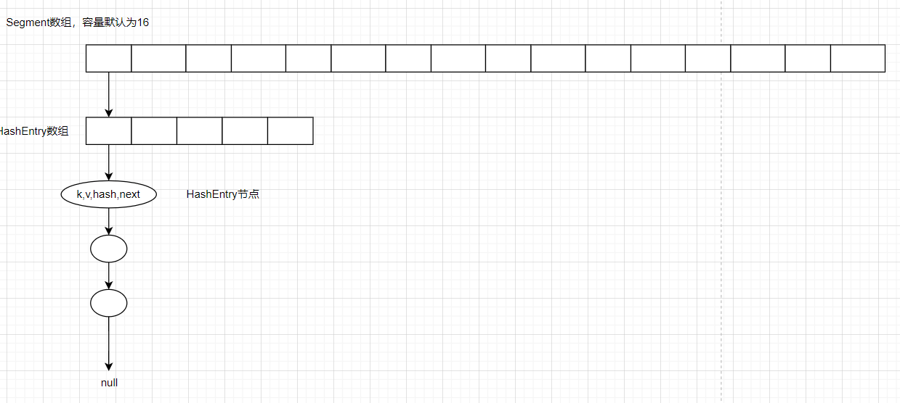

#### 第一部分：引论 - 为什么要用 `ConcurrentHashMap`？

- **问题引入**：从 `HashMap` 在多线程环境下可能导致的**死循环、数据丢失**等问题切入。
- **对比分析**：比较 `HashMap`（非线程安全）、`Hashtable`（全表锁，并发度低）和 `Collections.synchronizedMap`（同样低效）的优劣，点明 `ConcurrentHashMap` 在并发场景下的必要性。

#### 第二部分：JDK 1.7 的实现 - 分段锁机制（理解演进）

- **核心数据结构**：理解 **`Segment` 数组 + `HashEntry` 数组 + 链表**的结构。`Segment` 继承自 `ReentrantLock`，扮演锁的角色。
- **并发控制**：**写操作**时锁定对应的 `Segment`；**读操作**则通过 `volatile` 保证可见性，无需加锁。
- **关键源码**：
  - **初始化**：重点关注 `concurrencyLevel` 参数如何决定 `Segment` 数组的大小（默认16）。
  - **`put` 方法**：观察如何定位 `Segment` 并上锁。
  - **`get` 方法**：分析其**无锁化**的实现。
- **总结与思考**：分析分段锁的优点（支持默认16个线程并发写）与缺点（结构复杂， `Segment` 数量固定，扩容粒度小）。

#### 第三部分：JDK 1.8 的实现 - CAS + Synchronized（掌握精髓）

- **数据结构革新**：废弃 `Segment`，采用 **`Node` 数组 + 链表 + 红黑树** 的结构。
- **并发控制**：采用更细粒度的 **CAS（Compare-And-Swap）+ `synchronized`** 锁住桶的头节点。
- **关键源码（重点）**：
  1. **核心成员变量**：理解 `table`、`nextTable`、`baseCount`、`sizeCtl` 等关键字段的作用。
  2. **初始化**：分析 `sizeCtl` 如何控制 **延迟初始化**（首次 `put` 时才创建数组）。
  3. **`put` 方法**：这是最核心的方法。跟踪其完整流程：
     - **空桶**：通过 **`CAS`** 直接插入新节点。
     - **扩容中**：如果桶被标记为 `MOVED`，当前线程**协助扩容**（`helpTransfer`）。
     - **非空桶**：使用 **`synchronized`** 锁住桶的头节点，然后在链表或红黑树中执行插入或更新操作。
     - **链表树化**：当链表长度超过阈值（8）时，调用 `treeifyBin` 将链表转换为红黑树。
     - **扩容检查**：最后调用 `addCount` 检查是否需要扩容。
  4. **`get` 方法**：分析其**全程无锁**的高效实现。
  5. **扩容机制**：
     - **多线程协同**：多个线程可以同时参与扩容，提高效率。
     - **`transfer` 方法**：理解数据如何从旧表迁移到新表。
     - **`ForwardingNode`**：掌握扩容期间，旧桶上的这个占位标记节点的作用。
  6. **`size()` 方法**：
     - **`baseCount` + `CounterCell`**：理解其类似于 `LongAdder` 的设计思想。
     - **`sumCount()`**：分析它如何累加 `baseCount` 和所有 `CounterCell` 的值来获取总数。

#### 第四部分：总结与对比

- **JDK 1.7 vs JDK 1.8**：从**数据结构、锁的实现、锁粒度、扩容机制**等多个维度进行对比总结。
- **实战建议**：给出在不同场景下的使用建议。


## 引言

### HashMap的并发问题

单线程视角下，调用HashMap.put()元素时，放入元素后，若元素总数>=阈值时，会触发扩容，扩容则进行：创建新数组和计算新阈值、rehash(将旧数组元素重新分配到新数组)、用新数组替代旧数组。 等待下一次调用HashMap.put()方法。

单线程视角下的put和扩容都没有问题，那多线程视角呢？

在多线程视角下，put和扩容时存在并发问题。

#### 数据丢失问题

##### 桶位为空的快速插入

若线程A判断当前桶位为空，正准备插入时，线程B同样判断同一个桶位为空，抢先插入该位置。而导致线程A覆盖了线程B的数据。后执行的线程会覆盖先执行线程的节点，导致一个键值对直接丢失。

##### 插入链尾和树尾

- 两个线程在同一个桶的链表中遍历到尾部，各自创建节点并尝试接到末尾，但 `next` 指针的赋值不是原子的，可能导致其中一个节点丢失。

```java
if ((e = p.next) == null) {
                        p.next = newNode(hash, key, value, null);
                        if (binCount >= TREEIFY_THRESHOLD - 1) // -1 for 1st
                            treeifyBin(tab, hash);
                        break;
}
```

##### 大小计数（size）丢失

HashMap 的 `size` 字段维护了键值对总数，每次 `put` 成功后会执行 `++size`。该操作 **不是原子的**：

比如：线程 A 和 B 同时读取 `size = 10`，各自计算后写入 `size = 11`（实际应变为 12）。

##### 扩容时的数据丢失问题

情况：线程A检测到HashMap需要扩容，并创建新的数组，线程B在线程A扩容完成前，向HashMap的旧数组添加了一个新元素。

原因：由于线程A扩容时是按哈希桶一个个进行遍历的，线程B的数据可能添加在已遍历的哈希桶中。

结果： 从而导致扩容完成后，线程B添加的数据丢失。

### HashTable

HashTable是一个线程安全的类，它使用synchronized来锁住整张Hash表来实现线程安全，即每次锁住整张表让线程独占，相当于所有线程进行读写时都去竞争一把锁，导致效率非常低下。

另外则是若HashTable的存储的数据量较多，则进行扩容时，由于重新分配到新数组中，持有锁的时间会很长。

写（put）

```java
public synchronized V put(K key, V value) {
        // Make sure the value is not null
        if (value == null) {
            throw new NullPointerException();
        }

        // Makes sure the key is not already in the hashtable.
        Entry<?,?> tab[] = table;
        int hash = key.hashCode();
        int index = (hash & 0x7FFFFFFF) % tab.length;
        @SuppressWarnings("unchecked")
        Entry<K,V> entry = (Entry<K,V>)tab[index];
    	// 相同Key则覆盖value
        for(; entry != null ; entry = entry.next) {
            if ((entry.hash == hash) && entry.key.equals(key)) {
                V old = entry.value;
                entry.value = value;
                return old;
            }
        }
		// 创建新Entry加入
        addEntry(hash, key, value, index);
        return null;
    }
```

读（read）

```java
public synchronized V get(Object key) {
        Entry<?,?> tab[] = table;
        int hash = key.hashCode();
        int index = (hash & 0x7FFFFFFF) % tab.length;
        for (Entry<?,?> e = tab[index] ; e != null ; e = e.next) {
            if ((e.hash == hash) && e.key.equals(key)) {
                return (V)e.value;
            }
        }
        return null;
    }
```

### Collections.synchronizedMap

通过 `Collections.synchronizedMap(map)`将 `map`为入参返回一个 `SynchronizedMap`

```java
public static <K,V> Map<K,V> synchronizedMap(Map<K,V> m) {
        return new SynchronizedMap<>(m);
    }
```

SynchronizedMap是Collections的内部静态类，其底层就相当于对传入的 map包装了一层 synchronized(mutex)

```java
private static class SynchronizedMap<K,V> implements Map<K,V>, Serializable {
        private final Map<K,V> m;
        final Object      mutex;   // 用作synchronize的互斥锁
        
        public V put(K key, V value) {
            synchronized (mutex) {return m.put(key, value);}
        }
    	public V remove(Object key) {
            synchronized (mutex) {return m.remove(key);}
        }
    	public V get(Object key) {
            synchronized (mutex) {return m.get(key);}
        }
}
```

这样导致同一时刻只能有一个线程能够读写 `map`。感觉与 `HashTable`实现的效果无异。两者都是**粗粒度锁**的全局锁，同一时刻只允许一个线程操作整个 Map。

----

## ConcurrentHashMap1.7 

### 数据结构

采用数组+数组+链表形式存储



ConcurrentHashMap 采用了 **两级哈希** 的结构，

- **第一级**：一个 **`Segment` 数组**。每个 `Segment` 都继承自 `ReentrantLock`，因此自带锁的功能，它守护着其内部的一个 `HashEntry` 数组。segment数组容量默认是16，可自定义大小，一旦初始化便固定且Segment数组不可扩容。
- **第二级**：每个 `Segment` 内部维护一个 **`HashEntry` 数组**，用于存储实际的键值对。`HashEntry` 是一个典型的单向链表节点。

```java
// ConcurrentHashMap 的核心成员
final Segment<K,V>[] segments;

// Segment 的结构
static final class Segment<K,V> extends ReentrantLock implements Serializable {
    transient volatile HashEntry<K,V>[] table; // 每个 Segment 拥有自己的 HashEntry 数组
    transient int count;
    transient int modCount;
    // ...
}

// HashEntry 节点
static final class HashEntry<K,V> {
    final int hash;
    final K key;
    volatile V value;          // 用 volatile 保证可见性
    volatile HashEntry<K,V> next; // 用 volatile 保证可见性
}
```

### 构造方法：初始化Segment数组和HashEntry数组

```java
public ConcurrentHashMap(int initialCapacity,
                         float loadFactor, int concurrencyLevel) {
     // 1. 参数校验...
    // 2. 限制并发级别最大值，防止数组过大...
     // 3. 计算 segmentShift 和 segmentMask，用于定位 Segment
    int sshift = 0;      // 用于记录左移位数
    int ssize = 1;       // Segment 数组的实际长度
    while (ssize < concurrencyLevel) {
        ++sshift;
        ssize <<= 1;     // 找到大于等于 concurrencyLevel 的最小 2 的幂
    }
    this.segmentShift = 32 - sshift; // 例如 concurrencyLevel=16，sshift=4，segmentShift=28
    this.segmentMask = ssize - 1;    // 例如 ssize=16，segmentMask=15
    // 4. 计算每个 Segment 中 HashEntry 数组的初始长度
    if (initialCapacity > MAXIMUM_CAPACITY)
        initialCapacity = MAXIMUM_CAPACITY; // MAXIMUM_CAPACITY = 1 << 30
    int c = initialCapacity / ssize; // 每个 Segment 管理的元素数
    if (c * ssize < initialCapacity)
        ++c; // 向上取整，保证总容量足够
    int cap = MIN_SEGMENT_TABLE_CAPACITY; // MIN_SEGMENT_TABLE_CAPACITY = 2
    while (cap < c)
        cap <<= 1; // 找到大于等于 c 的最小 2 的幂，且最小为 2
    // 5. 创建第一个 Segment 作为原型，后续的 Segment 会基于它创建
    Segment<K,V> s0 =
        new Segment<K,V>(loadFactor, (int)(cap * loadFactor),
                         (HashEntry<K,V>[])new HashEntry[cap]);
    // 6. 创建 Segment 数组，并将第一个 Segment 放入数组
    Segment<K,V>[] ss = (Segment<K,V>[])new Segment[ssize];
    UNSAFE.putOrderedObject(ss, SBASE, s0); // 原子性写入第一个元素
    this.segments = ss;
}
```

上述构造方法，初始化Segment数组容量和每个HashEntry数组的初始容量

- Segment数组的容量 `ssize = 大于等于 concurrencyLevel 的最小 2 的幂`。
- HashEntry数组的容量 `cap = (initialCapacity / ssize)并向上取整， 取大于等于的最小2的幂`

`concurrencyLevel`表示并发等级，就是同一时间最多能有多少线程操作ConcurrentHashMap，本质就是ConcurrentHashMap内Segment数组的大小(还需取最小2次幂)。

### Put(K,V)

```java
ConcurrentHashMap.class
public V put(K key, V value) {
    Segment<K,V> s;
    if (value == null)
        throw new NullPointerException();
    int hash = hash(key); // 第一次哈希
    // 通过 hash 值定位到具体的 Segment
    int j = (hash >>> segmentShift) & segmentMask;
    if ((s = (Segment<K,V>)UNSAFE.getObject(segments, (j << SSHIFT) + SBASE)) == null)
        s = ensureSegment(j); // 如果该 Segment 为空，则初始化（CAS 操作）
    return s.put(key, hash, value, false); // 进入 Segment 执行 put
}
```

ConcurrentHashMap.put()定位到正确的Segment位置

```java
Segment.class
final V put(K key, int hash, V value, boolean onlyIfAbsent) {
    // 1. 尝试获取锁，失败则自旋等待 (scanAndLockForPut)
    HashEntry<K,V> node = tryLock() ? null : scanAndLockForPut(key, hash, value);
    V oldValue;
    try {
        HashEntry<K,V>[] tab = table;
        int index = (tab.length - 1) & hash; // 第二次哈希，定位到 HashEntry 数组下标
        HashEntry<K,V> first = entryAt(tab, index);
        // 2. 遍历链表，查找 key 是否已存在
        for (HashEntry<K,V> e = first;;) {
            if (e != null) {
                K k;
                if ((k = e.key) == key || (e.hash == hash && key.equals(k))) {
                    // 找到，更新值
                    oldValue = e.value;
                    if (!onlyIfAbsent) {
                        e.value = value;
                        ++modCount;
                    }
                    break;
                }
                e = e.next;
            } else {
                // 3. 未找到，插入新节点
                if (node != null)
                    node.setNext(first); // 头插法
                else
                    node = new HashEntry<K,V>(hash, key, value, first);
                int c = count + 1;
                if (c > threshold && tab.length < MAXIMUM_CAPACITY)// 超过阈值，则先扩容后插入新节点
                    rehash(node); // 先扩容后插入新节点
                else
                    setEntryAt(tab, index, node);
                ++modCount;
                count = c;
                oldValue = null;
                break;
            }
        }
    } finally {
        unlock(); // 4. 释放锁
    }
    return oldValue;
}
```

- `Segment` 继承了 `ReentrantLock`， `tryLock()` 是 `ReentrantLock` 提供的**非阻塞**获取锁的方法。
  - 如果锁当前未被其他线程持有，则立即获取锁并返回 `true`；否则返回 `false`，**不会阻塞当前线程**。
- 当 `tryLock()` 失败时，说明锁正被其他线程持有。此时进入 `scanAndLockForPut` 方法，自旋获取锁。

#### scanAndLockForPut()

自旋获取锁并预创建节点

```java
private HashEntry<K,V> scanAndLockForPut(K key, int hash, V value) {
    HashEntry<K,V> first = entryForHash(this, hash); // 获取该桶的第一个节点
    HashEntry<K,V> e = first;
    HashEntry<K,V> node = null;
    int retries = -1; // 自旋计数器

    while (!tryLock()) { // 循环尝试获取锁
        HashEntry<K,V> f; // to recheck first below
        if (retries < 0) {
            if (e == null) {
                // 若该桶为空，则预创建新节点（但未插入）
                if (node == null)
                    node = new HashEntry<K,V>(hash, key, value, null);
                retries = 0;
            } else if (key.equals(e.key)) {
                // 若找到相同 key，则无需创建新节点，直接设置 retries = 0
                retries = 0;
            } else {
                // 继续遍历链表
                e = e.next;
            }
        } else if (++retries > MAX_SCAN_RETRIES) {
            // 超过最大自旋次数（64或CPU核心数相关），则阻塞等待锁
            lock();
            break;
        } else if ((retries & 1) == 0 &&
                   (f = entryForHash(this, hash)) != first) {
            // 每两次自旋检查一次链表的头节点是否发生变化
            // 若变化，则重新遍历
            e = first = f;
            retries = -1;
        }
    }
    return node;
}
```

- 循环尝试获取锁，并在该过程中，无相同key则预创建新节点
- 超过最大自旋次数，则使用Lock()方法 阻塞等待锁(不断自旋，占用CPU)
- 检查头节点是否变化，变化则重新定位链表的起始位置，保证后续插入操作的正确性

### get(K)

```java
public V get(Object key) {
    Segment<K,V> s;
    HashEntry<K,V>[] tab;
    int h = hash(key);
    // 1. 定位到 Segment
    long u = (((h >>> segmentShift) & segmentMask) << SSHIFT) + SBASE;
    if ((s = (Segment<K,V>)UNSAFE.getObjectVolatile(segments, u)) != null &&
        (tab = s.table) != null) {
        // 2. 定位到 HashEntry 并遍历链表查找
        for (HashEntry<K,V> e = (HashEntry<K,V>) UNSAFE.getObjectVolatile
                 (tab, ((long)(((tab.length - 1) & h)) << TSHIFT) + TBASE);
             e != null; e = e.next) {
            K k;
            if ((k = e.key) == key || (e.hash == h && key.equals(k)))
                return e.value; // 3. 找到返回
        }
    }
    return null;
}
```

`get` 方法为何不需要加锁？ 因为 `HashEntry` 的 `value` 和 `next` 属性都使用了 `volatile` 关键字修饰，保证了可见性。如果 `value`和 `next`被修改了，当前线程会即使察觉到内存每个HashEntry `value`和 `next` 的变化。

不过**值得注意**的是，这里的get并不能保证获取到的是最新的数据，是 弱一致性的。 比如 在遍历 A->B->C->D的过程中，到达B时，B和C都被另一个线程移除，这里的 `B.next`和 `C.next` 都没有发生改变，改变的是 `A.next`指向D，所以线程还是会继续遍历 C->D。

数据一致的情况：在遍历 A->B->C->D的过程中，到达B时，C被另一个线程移除，这里的 `B.next`发生改变，线程会遍历 D。


----

## ConcurrentHashMap1.8详解

数据结构

```java
transient volatile Node<K,V>[] table;
```


----

## 常见问题

### 1.7和1.8的区别？


**为什么 `key` 和 `value` 不能为 `null`？** 

- Key不为null：避免对特殊 `null` 值的特殊哈希处理，在并发场景下维护简单性和性能。

- value不为null：为了支持并发。当 `get(key)` 返回 `null` 时，无法判断是 key 不存在，还是 key 存在但值为 `null`。在并发环境下，这种二义性会带来问题。


## 参考文档

[【集合框架ConcurrentHashMap进阶】-腾讯云开发者社区-腾讯云](https://cloud.tencent.com.cn/developer/article/2561469?from=15425&frompage=seopage)

[ConcurrentHashMap详解：原理、实现与并发控制-CSDN博客](https://blog.csdn.net/Dcein/article/details/148591286)

[(8 封私信 / 80 条消息) 一文读懂Java ConcurrentHashMap原理与实现 - 知乎](https://zhuanlan.zhihu.com/p/104515829)

[ConcurrentHashMap源码解析6.TreeBin类_concurrentmap treebin waiter-CSDN博客](https://blog.csdn.net/qq_46312987/article/details/121568509)
