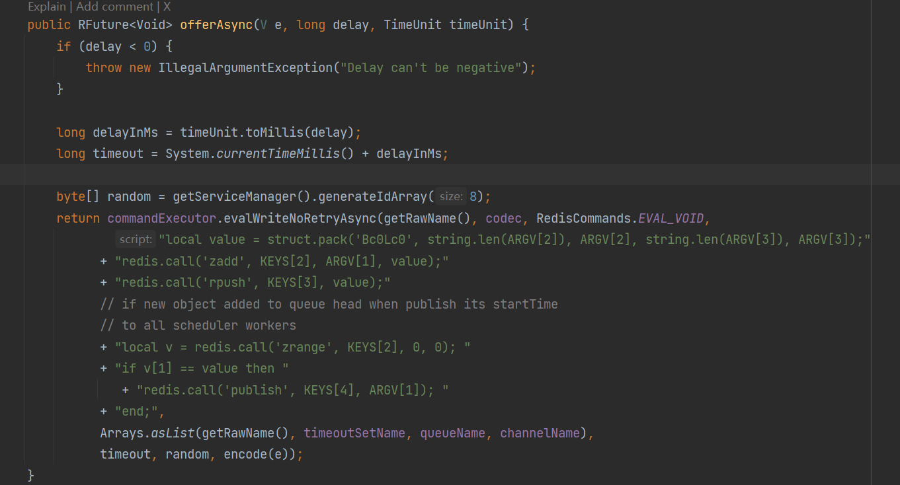
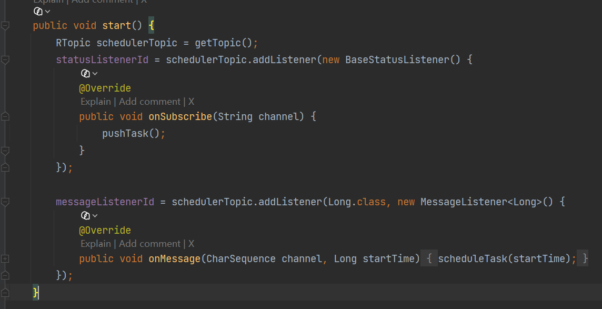

## 常见方案及比对

| 方案                   | 延迟精度 | 吞吐量 | 可靠性 | 实现复杂度 | 适用场景                                  |
| ---------------------- | -------- | ------ | ------ | ---------- | ----------------------------------------- |
| 定时任务扫表           | 分钟级   | 极低   | 极高   | 低         | 数据量小                                  |
| RocketMQ延迟消息       | 秒级     | 极高   | 极高   | 低         | 大型分布式系统，高并发                    |
| RabbitMQ延迟插件       | 毫秒级   | 高     | 极高   | 中         | 中大型系统                                |
| Kafka时间轮            | 毫秒级   | 高     | 极高   | 高         | 大型分布式系统                            |
| Redisson(DelayedQueue) | 秒级     | 中高   | 中     | 低         | 中小型系统，已有Redis，允许消息小概率丢失 |

1. **如果公司有 RocketMQ**：毫不犹豫使用 RocketMQ 的定时消息，这是最优雅、最可靠的方案。
2. **如果公司有 RabbitMQ**：安装延迟插件，使用延迟消息交换机。
3. **如果只有 Redis 且业务允许极小概率不一致**：用 Redisson，无需重复造轮子。
4. **如果是金融级核心链路（如支付超时关闭，漏单绝对不行）**：不要完全依赖Redis。使用 **MQ延迟 + 最终兜底扫表** 的双保险方案。即使MQ没消费到，定时任务每天凌晨也会扫出来补偿。

----

## 基于延迟队列实现订单延迟关闭/超时取消的实现

`RDelayedQueue` 是 Redisson 提供的一个接口，用于实现延迟队列的功能。它允许将元素延迟一段时间后再被消费。实现延迟队列的步骤如下：

1. **创建 RDelayedQueue**：首先需要创建一个普通的队列（例如 `RQueue` 或 `RBlockingQueue`），然后使用这个队列创建一个 `RDelayedQueue` 实例
2. **添加延迟元素**：通过 `RDelayedQueue` 的 `offer` 方法添加元素，并指定延迟时间。元素将在指定的延迟时间后自动转移到原始队列中，随后可被消费
3. **消费元素**：从原始队列中消费元素。如果是 `RBlockingQueue`，消费者可以阻塞等待直到元素可用

添加延迟元素

```java
public void produce() {
  String queuename = "delay-queue";
  RBlockingQueue<String> blockingQueue = redissonClient.getBlockingQueue(queuename);
  RDelayedQueue<String> delayedQueue = redissonClient.getDelayedQueue(blockingQueue);
  delayedQueue.offer("测试延迟消息", 5, TimeUnit.SECONDS);
}
```

消费延迟元素

```java
public void consume() throws InterruptedException {
 String queuename = "delay-queue";
  RBlockingQueue<String> blockingQueue = redissonClient.getBlockingQueue(queuename);
  RDelayedQueue<String> delayedQueue = redissonClient.getDelayedQueue(blockingQueue);
  String msg = blockingQueue.take();
  //收到消息进行处理...
}
```

#### 延迟订单取消

```
public String createOrder() {
	// 创建订单...
  String queuename = "delay-queue-order-cancel";
  RBlockingQueue<String> blockingQueue = redissonClient.getBlockingQueue(queuename);
  RDelayedQueue<String> delayedQueue = redissonClient.getDelayedQueue(blockingQueue);
  delayedQueue.offer(orderCancelDto, 5, TimeUnit.SECONDS);
}
```

开启线程池监听阻塞队列获取消息进行消费

```java
 listenStartThreadPool.execute(() -> {
                while (!Thread.interrupted()) {
                    try {
                        assert blockingQueue != null;
                        String content = blockingQueue.take();
                        //收到消息进行处理...
                    }catch (Exception e) {
                        log.error("consumer execute error",e);
                    }
                }
            });
```

优化：可基于Topic（主题）创建多个延迟队列，生产的消息依次放入到延迟队列中，而通过线程池监听每一个阻塞队列，从阻塞队列获取消息后，通过任务执行线程池进行并发消费，提交消息处理性能。

-----

## RDelayedQueue的原理

> 基于一个ZSet+两个List+Pub/Sub模式 实现延迟队列

### 内部数据结构

分为三个队列

* 【消息延时队列】`Zset`类型，利用按照到期时间排序的特性，可以很快找到下一个要到期的消息，客户端内部自己定时到【消息目标队列】取
* 【消息顺序队列】实现Zset难实现的方法，包括contain、remove、readAll等方法
* 【消息目标队列】`List` 类型，存放到期的消息，供消费端取

【消息延时队列】队列里存的时间（也就是 zet 的 score）是到期的时间戳

**把到期的消息从【消息延时队列】移到【消息目标队列】里** ，这句话实际的代码逻辑是这样：把【消息延时队列】和【消息顺序队列】里的到期消息移除，把它们插入到【消息目标队列】

### 基本流程

先说**发送延迟消息** ，发送的延迟消息会先存在【消息延时队列】和【消息顺序队列】，如果【消息延时队列】原本是空的，会发布订阅信息提醒有新的消息。

**获取延迟消息** 只需要从【消息目标队列】阻塞的取就行了，因为里面都是到期数据。

#### 怎么样判断时间到了，把【消息延时队列】里的消息移动到【消息目标队列】里呢？

这部分工作交给了**初始化延时队列** 来处理。

这里面会定时从【消息延时队列】查询最新到期时间，定时去把【消息延时队列】里的消息移动到【消息目标队列】里。

如果【消息延时队列】是空的，就不会再定时查，而是等待发布订阅信息提醒，再定时把【消息延时队列】里的消息移动到【消息目标队列】里。

### 发送延迟队列的消息

#### 源码解析

```java
public void produce() {
  String queuename = "delay-queue";
  RBlockingQueue<String> blockingQueue = redissonClient.getBlockingQueue(queuename);
  RDelayedQueue<String> delayedQueue = redissonClient.getDelayedQueue(blockingQueue);
  delayedQueue.offer("测试延迟消息", 5, TimeUnit.SECONDS);
}
```

`RedissonDelayedQueue.offer()`底层调用`RedissonDelayedQueue.offerAsync`)



```java
public RFuture<Void> offerAsync(V e, long delay, TimeUnit timeUnit) {
        if (delay < 0) {
            throw new IllegalArgumentException("Delay can't be negative");
        }

        long delayInMs = timeUnit.toMillis(delay);
        long timeout = System.currentTimeMillis() + delayInMs;

        byte[] random = getServiceManager().generateIdArray(8);
        return commandExecutor.evalWriteNoRetryAsync(getRawName(), codec, RedisCommands.EVAL_VOID,
                "local value = struct.pack('Bc0Lc0', string.len(ARGV[2]), ARGV[2], string.len(ARGV[3]), ARGV[3]);"
              + "redis.call('zadd', KEYS[2], ARGV[1], value);"
              + "redis.call('rpush', KEYS[3], value);"
              // if new object added to queue head when publish its startTime 
              // to all scheduler workers 
              + "local v = redis.call('zrange', KEYS[2], 0, 0); "
              + "if v[1] == value then "
                 + "redis.call('publish', KEYS[4], ARGV[1]); "
              + "end;",
              Arrays.asList(getRawName(), timeoutSetName, queueName, channelName),
              timeout, random, encode(e));
    }
```

- `timeout`: 当前时间+延迟时间，作为`ZSet`的`score`

- `random`:因为延迟队列中可能会有相同的元素,随机 ID 保证了 ZSet 和 List 中元素的唯一性

- Key的映射
  
  * `KEYS[1]`: `getRawName()` (原队列名，Lua脚本中未直接使用，但作为上下文传入)
  * `KEYS[2]`: `timeoutSetName` (存放延迟时间的 ZSet)
  * `KEYS[3]`: `queueName` (存放实际元素的 List)
  * `KEYS[4]`: `channelName` (用于发布通知的 Pub/Sub 频道)

- `redis.call('zadd', KEYS[2], ARGV[1], value);`  将 `value` 添加到 `timeoutSetName`（有序集合）中，分数（score）为前面计算的 `timeout`（过期时间戳）。

- `redis.call('rpush', KEYS[3], value);`  同时将 `value` 追加到 `queueName`（列表）的尾部

- `redis.call('zrange', KEYS[2], 0, 0);`获取 ZSet 中分数最小（即最早到期）的元素

- `if v[1] == value then redis.call('publish', KEYS[4], ARGV[1]);`当前插入的消息是最近到期消息，则让订阅者获取到期时间

Lua脚本的内容总结为

* **将消息和到期时间插入【消息延时队列】和【消息顺序队列】**

* **如果最近到期的消息是刚刚插入的消息，则对指定主题发布到期时间，目的是为了让客户端定时去把【消息延时队列】里的到期数据移动到【消息目标队列】**

```
若消息延迟队列里没有消息，则不会定时查该队列；若新添加了消息，则会publish，发布有新的消息订阅，则消费者就会定时去查该队列；若新添加的消息是最新的消息，则发布新的消息订阅，更新最早过期时间，改变定时查询时间。
```

#### ZSet增加的唤醒机制

* **唤醒机制**：当新插入的任务的到期时间比 ZSet 中现有所有任务的到期时间都早时，它会成为 ZSet 的第一个元素。此时，调度器需要立刻被唤醒（通过 Pub/Sub），否则调度器还在傻等之前的“最早时间”，导致这个更高优先级的任务被延迟处理。

#### 为什么需要zset和list两个数据结构配合使用

ZSet，能解决按时间排序和到期检测的问题，但在消费时存在致命缺陷：ZSet 的 `zpopmin` 等弹出操作在 Redis 早期版本中不是原子的（需要先查后删），在分布式并发环境下，极易导致**同一个任务被多个消费者同时获取（重复消费）**

当 ZSet 中有任务到期时，将任务从 ZSet 中移除，通过 `RPUSH`操作，将任务**转移**到另一个目标 List 中

消费者直接使用 `BLPOP`（阻塞弹出）从目标 List 中获取任务。`BLPOP` 是 `Redis` 原生支持的原子操作，天然保证了**一个任务只会被一个消费者获取**，彻底避免了并发竞争和重复消费的问题。

#### evalWriteNoRetryAsync

方法名中带有 `NoRetry`，意味着如果 `Redis` 集群发生主从切换或连接异常导致该脚本执行失败，`Redisson` **不会自动重试**。因为如果重试，可能会导致消息被重复插入（幂等性问题）。调用方需要自行处理这次异步操作的异常结果。

#### Pub/Sub 的网络抖动风险：

当插入了一个最早到期的任务时，会通过 `publish` 通知调度器。如果此时 Redis 调度器与 Redis 之间的网络断开，可能会丢失这条通知。不过 `Redisson` 有兜底机制：调度器除了监听 Pub/Sub，通常还会有一个后台定时任务（如每秒）去轮询 ZSet，所以即使通知丢失，任务也只会延迟触发，不会漏触发。

### 获取延迟队列的消息

```java
public void consume() throws InterruptedException {
  String queuename = "delay-queue";
  RBlockingQueue<String> blockingQueue = redissonClient.getBlockingQueue(queuename);
  RDelayedQueue<String> delayedQueue = redissonClient.getDelayedQueue(blockingQueue);
  String msg = blockingQueue.take();
  //收到消息进行处理
...
}
```

`blockingQueue.take();`底层调用的是`RedissonBlockingQueue.takeAsync()`

```java
public RFuture<V> takeAsync() {
        return commandExecutor.writeAsync(getRawName(), codec, RedisCommands.BLPOP_VALUE, getRawName(), 0);
    }
```

可以看出**其实只是对【消息目标队列】执行 blpop 阻塞的获取到期消息**（`blpop`从List中移除并返回第一个元素的阻塞命令）

### 初始化延迟队列

核心作用：初始化延时队列的作用是会定时去把【消息延时队列】里的到期数据移动到【消息目标队列】

#### 主要流程

1. **应用启动**，创建延迟队列对象。注册订阅监听器和消息监听器
2. 有节点**订阅`Redis Channel`** 成功，触发**订阅监听器**，调用 `onSubscribe`，**第一次执行 `pushTask()`**。
3. `Lua`脚本执行，将`ZSet`中积压的**已过期任务转移到List**，并返回`ZSet`中**最快到期任务的到期时间**（假设是T1）。
4. 拿到T1，计算 `delay = T1 - now`。在时间轮里**注册一个定时器**，闹钟定在T1时刻。
5. **时间流逝...** 闹钟时间到！
6. **第二次执行 `pushTask()`**。`Lua`脚本再次把到期的任务转移到List，并返回下一个最近到期时间（T2）。
7. 拿到T2，重新在时间轮里注册定时器，闹钟定在T2时刻。
8. **如此循环往复...**

**那么，消息监听器是用来干嘛的？**
假设在步骤6等待期间，业务代码突然新增了一个比T1更早到期的任务（比如T0，T0 < T1）。
此时，新增任务向`Redis Channel`发布一条消息，触发消息监听器，调用 `onMessage`，里面调用了 `scheduleTask(T0)`。
`scheduleTask` 发现 T0 比当前时间轮里设定的T1还要早，就会**取消原来的定时器，重新设一个T0的定时器**。

#### 延迟队列初始化代码:

```java
public void init() {
    String queuename = "delay-queue";
    RBlockingQueue<String> blockingQueue = redissonClient.getBlockingQueue(queuename);
    RDelayedQueue<String> delayedQueue = redissonClient.getDelayedQueue(blockingQueue);
}
```

只要有客户端调用 `RedissonClient.getDelayedQueue(queue)`，就会注册监听器，就能做到消息转移(ZSet->List)。也就是说不管是生产者还是消费者，都会进行消息转移。

`redissonClient.getDelayedQueue(blockingQueue)`底层调用的是  `QueueTransferTask.start()`

#### `QueueTransferTask.start`（）



向一个`Redis`主题注册**两个监听器**来实现任务的触发和调度：

1. **状态监听器**：当有节点订阅该主题成功时，立即主动推送任务。
2. **消息监听器**：当接收到特定格式的消息（包含时间戳）时，根据该时间戳来调度任务。

`pushTask()`内部调用 `pushTaskAsync()`， `scheduleTask()`内部调用 `pushTask()`

#### ⭐`pushTaskAsync()` （异步推送任务）

```java
protected RFuture<Long> pushTaskAsync() {
                return commandExecutor.evalWriteAsync(getRawName(), LongCodec.INSTANCE, RedisCommands.EVAL_LONG,
                        "local expiredValues = redis.call('zrangebyscore', KEYS[2], 0, ARGV[1], 'limit', 0, ARGV[2]); "
                      + "if #expiredValues > 0 then "
                          + "for i, v in ipairs(expiredValues) do "
                              + "local randomId, value = struct.unpack('Bc0Lc0', v);"
                              + "redis.call('rpush', KEYS[1], value);"
                              + "redis.call('lrem', KEYS[3], 1, v);"
                          + "end; "
                          + "redis.call('zrem', KEYS[2], unpack(expiredValues));"
                      + "end; "
                        // get startTime from scheduler queue head task
                      + "local v = redis.call('zrange', KEYS[2], 0, 0, 'WITHSCORES'); "
                      + "if v[1] ~= nil then "
                         + "return v[2]; "
                      + "end "
                      + "return nil;",
                      Arrays.asList(getRawName(), timeoutSetName, queueName),
                      System.currentTimeMillis(), 100);
            }
```

Keys映射

`KEYS[1]`: 消息目标列表List

`KEYS[2]`: 消息延迟列表Zset

`KEYS[3]`:  消息顺序列表

1. `zrangebyscore`:从 ZSet 查出过期数据
2. 过期消息数量大于0，则存入目标消息列表和移除顺序消息列表，移除延迟消息列表

核心目的是**将延迟队列中已经到期的任务，平滑地转移到目标执行队列中，并返回下一个最近到期任务的执行时间**

#### `pushTask`（任务推送）：

```java
private void pushTask() {
        RFuture<Long> startTimeFuture = pushTaskAsync();
        startTimeFuture.whenComplete((res, e) -> {
            if (e != null) {
                if (e instanceof RedissonShutdownException) {
                    return;
                }
                log.error(e.getMessage(), e);
                scheduleTask(System.currentTimeMillis() + 5 * 1000L);
                return;
            }

            if (res != null) {
                scheduleTask(res);
            }
        });
    }
```

异步推送任务，并获取最近要到期消息的时间戳

有异常的话就调用 `scheduleTask()` 五秒后再执行一次 `pushTask()`。
没有异常的话如果有最近要到期消息的时间戳（说明【消息延时队列】里还有未到期消息），用这个最新到期时间调用 `scheduleTask()`，

#### `scheduleTask`（任务调度）

```java
private void scheduleTask(final Long startTime) {
        TimeoutTask oldTimeout = lastTimeout.get();
        if (startTime == null) {
            return;
        }

        if (oldTimeout != null) {
            oldTimeout.getTask().cancel();
        }

        long delay = startTime - System.currentTimeMillis();
        if (delay > 10) {
            Timeout timeout = serviceManager.newTimeout(new TimerTask() {
                @Override
                public void run(Timeout timeout) throws Exception {
                    pushTask();

                    TimeoutTask currentTimeout = lastTimeout.get();
                    if (currentTimeout.getTask() == timeout) {
                        lastTimeout.compareAndSet(currentTimeout, null);
                    }
                }
            }, delay, TimeUnit.MILLISECONDS);
            if (!lastTimeout.compareAndSet(oldTimeout, new TimeoutTask(startTime, timeout))) {
                timeout.cancel();
            }
        } else {
            pushTask();
        }
    }
```

存在旧任务则取消，若最新时间与当前时间差值小于10ms则立即推送任务，否则生成新的定时器。

----

## 其他问题

### 延迟队列应用场景

* **订单超时自动取消**：下单后 30 分钟未支付，自动取消订单并释放库存。
* **延迟消息推送**：用户注册成功后，延迟 24 小时发送关怀邮件。
* **重试机制**：任务执行失败后，延迟 5 秒再进行重试。
* **限时优惠**：活动到指定时间后自动结束。

### （消息丢失）`Redisson`延迟队列什么情况下消息会丢失

1. 极端的主从切换与数据未同步（最大风险）

`Redisson`的延迟队列底层依赖 `ZSet` 存放延迟消息。为了高可用，Redis通常会部署主从集群。

- **场景**：应用将一条延迟消息写入Master的ZSet中，Master正在将数据异步同步给Slave。此时，Master突然宕机，Sentinel/Cluster选举Slave升级为新的Master。如果那条消息还没来得及同步到Slave，它就**永远丢失了**。你的延迟任务永远不会被执行。

2. Lua脚本执行中途宕机

Redisson转移消息的核心逻辑（从ZSet转移到List）是用Lua脚本保证原子性的。

- **场景**：Lua脚本正在执行，已经执行了 `ZREM`（从ZSet删除了到期消息），正准备执行 `RPUSH`（放入就绪队列List），**就在这极其微小的间隙，Redis进程崩溃或服务器断电**。消息从ZSet中删除了，但没放进List。任务凭空消失。

3. Pub/Sub的“发后即忘”特性

Redisson通过Redis的Pub/Sub通知其他节点有新任务进来。Pub/Sub是一种**发后即忘**的模式。

- **场景**：节点A写入一个立刻到期的任务，并发布通知。节点B刚好因为Full GC或网络抖动断开了与Redis的连接。
- **后果**：节点B错过了这条通知。虽然节点A自己会执行 `pushTask`，但如果节点A在执行前也挂了，且没有其他节点来“兜底”触发，这个到期任务就会一直卡在ZSet里，直到有新的消息进来触发下一次全局扫描。
- **概率**：短暂的网络抖动很常见，但刚好在任务到期且执行节点挂掉的组合概率较小。

4. 客户端获取消息后宕机（经典问题）

这是所有消息队列都要面对的问题。

- **场景**：消费者通过 `LPOP` 或 `RPOP` 从就绪队列取出了消息，正准备处理业务逻辑，消费者所在的应用突然OOM崩溃或被Kill。
- **后果**：消息已经出队，但业务没执行。Redisson虽然实现了ACK机制（借用另一个集合暂存未确认消息），但如果消费者在取出消息且尚未放入暂存集合的几毫秒内崩溃，依然会丢失。

### （消息丢失）`Redisson`延迟队列如何保证消息不丢

基于本地消息表

### 生产者在消息到期前下线，而消费者未初始化延迟队列，会发生什么情况？

生产者在发送消息前，会调用`RedissonClient.getDelayedQueue(queue)`去初始化延迟队列，而初始化延迟队列的核心作用就是将过期消息从消息延迟列表(ZSet)转移到消息目标列表(List)，生产者提前下线且没有其他生产者，而消费者也没有延迟化队列，就会导致过期消息一直在消息延迟列表(ZSet)存放，而目标消息列表没有过期消息，过期消息一直没被消费。

###  （重复消费）多个客户端同时转移，会不会重复消费？

1. **多个客户端都在尝试转移，但同一条消息绝对不会被重复转移到目标队列中**

多个客户端同时监听延迟消息列表，定时去从该列表将过期消息转移到目标消息列表。在这个过程中，多个客户端调用`pushTaskAsync()`方法进行消息转移，里面用到Lua脚本，`rpush`+`zrem`分别从延迟消息列表移除和加入目标消息列表。由于 `Redis`是单线程且原子执行`Lua`，中间其他客户端不能插队，第一个客户端执行完成后，其他客户端接着执行时，通过 `zrangebyscore`获取过期消息发现没有，则不进行消息转移。

2. 多个消费者从目标队列取出同一个消息时。

### （重复消费）如果执行 `lua` 脚本到一半，宕机了，刚好放入到目标消息队列，而还没移除消息延迟队列呢？

Redis官方文档明确说明： Lua脚本要么全部执行，要么全部不执行 。如果脚本执行过程中Redis崩溃，脚本的所有效果都会被回滚。

但是！有一种极端情况：如果Redis启用了 AOF持久化 ，并且设置了 appendfsync everysec （每秒刷盘），那么：

- 步骤1和步骤2的写操作可能已经被写入AOF缓冲区
- 在刷盘之前Redis崩溃
- 重启后，AOF重放会恢复步骤1和步骤2的效果，但步骤3从未被执行

出现这种情况，会导致消息重复放入到目标消息队列中，从而被客户端重复消费。

Redis宕机概率极小，且Lua脚本执行速度极快，通常在毫秒级别，且AOF持久化最快是每秒刷盘，所以概率较低。**所以需要依赖业务幂等性。**

### 多生产节点争夺转移权带来的惊群效应

有一个微服务集群，有 10 个节点只负责产生延迟任务（比如创建订单），1 个节点负责消费延迟任务（比如取消订单）。
为了发消息，这 10 个生产者节点都初始化了 `RDelayedQueue`。

**结果**：

1. 这 10 个生产者节点都注册了 Pub/Sub 监听器，都启动了时间轮。
2. 每次有新订单创建，Redis 发出通知，**10 个生产者节点 + 1 个消费者节点同时被唤醒**，同时去 Redis 执行那段复杂的 Lua 脚本抢夺转移权。
3. 最终只有 1 个节点转移成功，另外 10 个节点做了无用功（这就是经典的**惊群效应 / Thundering Herd Problem**）。
4. 这会导致不必要的 Redis CPU 飙升，以及生产者节点的内存和线程浪费。

**解决方案**：
如果生产者非常多，通常建议：**生产者尽量复用**同一个 `RDelayedQueue` 实例（比如在 Spring 中设为单例 Bean）。

### 消息积压，将`Redis`撑爆

1. 延迟队列ZSet存储的数据除了订单id和延迟时间之外，尽量减少其他数据
2. 采用Redis+数据库混合架构，数据库进行定时任务扫描兜底保证延迟顶单取消。
3. 如果订单量实在庞大，可采用专用的MQ，如RocketMQ

----

## 参考

[开发实战：使用Redisson实现分布式延时消息，订单30分钟关闭的另外一种实现！-阿里云开发者社区](https://developer.aliyun.com/article/1627048)

[基于Redisson的高性能延迟队列架构设计与实现从去年到现在，这套延迟队列方案已经在生产环境稳定运行了一年多。期间经历 - 掘金](https://juejin.cn/post/7535356123886239784#heading-32)

[基于redis,redisson的延迟队列实践 - 字节悦动 - 博客园](https://www.cnblogs.com/better-farther-world2099/articles/15216447.html)

[Redisson 的延迟队列真的能用吗？一文看透原理 + 坑点_redission延时队列原理-CSDN博客](https://blog.csdn.net/Goligory/article/details/147646574)
