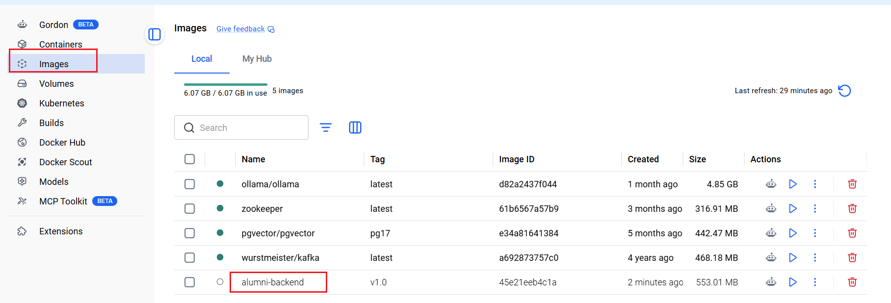
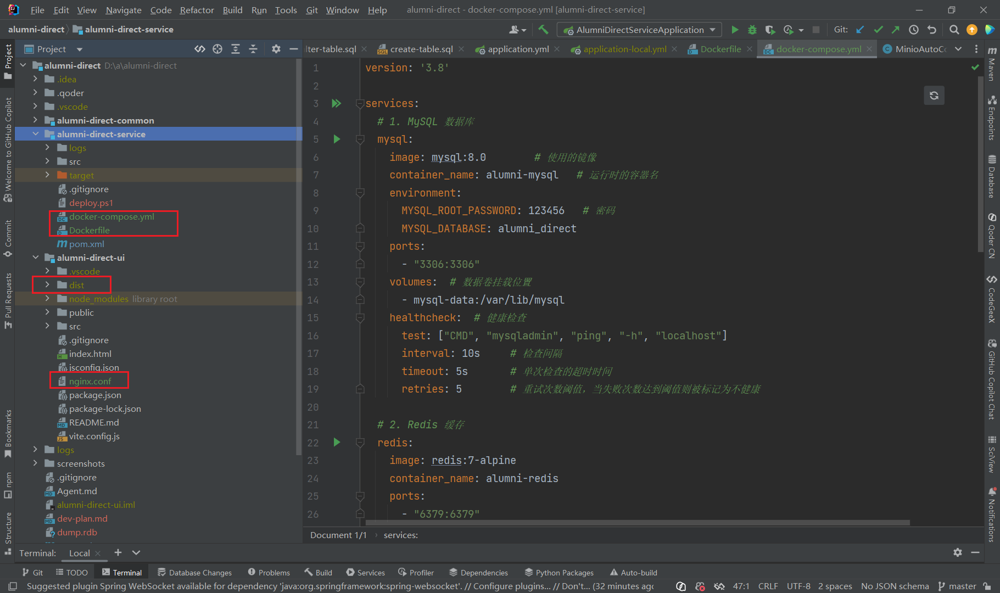
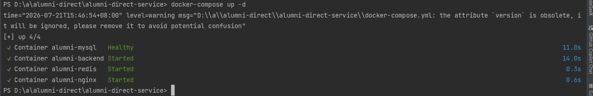
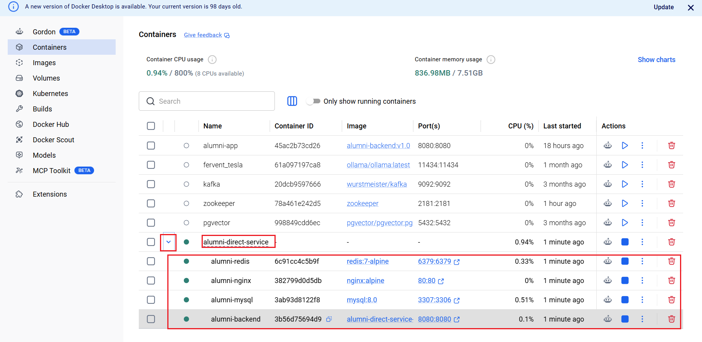

## 前言

Docker部署相较于经典的Linux命令部署的好处

- 环境一致性：镜像保证了开发、测试、生产环境的高度一致。
  - 之前使用无容器的方式，需要依赖本地的JDK和环境变量，而基于容器则已将环境封装在镜像中。
- 可移植性：构建好的镜像可以运行在任何安装有 Docker 的机器上。

----

## Dockerfile

`Dockerfile` 就是以文本格式记录一系列简单的指令，目的是构建一个 Docker 镜像。

通过学习后，发现Dockerfile并不是一连串的执行命令（如Linux部署脚本那样按序执行指令 `mvn+scp+java`）

Dockerfile 是静态配置。更像是一份“镜像配方”，定义了最终要打包成什么样的应用容器。而 `docker build` 命令才去执行构建镜像。

### Dockerfile指令介绍

`FROM`: 基础镜像

`WORKDIR`: 设置当前的工作目录，后续的命令都在该目录执行

`COPY`: 将本地的文件复制到镜像的指定目录中，该指定目录默认是上述的工作目录

`ENV`: 容器运行的环境变量，比如Java的 `-Xms256m -Xmx512m`

`EXPOSE`： 容器运行时使用的端口号

`ENTRYPOINT`：容器启动的入口，也就是执行的命令，如 `["sh", "-c", "java -jar app.jar]`

DockerFile目的是为了构建镜像，设置工作目录的作用是什么？

构建成的镜像里包含该工作目录，jar包放入到工作目录中，方便后续运行。

### 构建后端项目镜像并运行

#### 编写Dockerfile

```dockerfile
# 1. 使用一个轻量级的 OpenJDK 17 作为基础镜像
FROM openjdk:17-jdk-slim

# 2. 设置容器内的工作目录
WORKDIR /app

# 3. 将本地构建好的 JAR 包复制到工作目录，并重命名为 app.jar
COPY target/alumni-direct-service-0.0.1-SNAPSHOT.jar app.jar

# 4. 声明容器运行时将使用 8080 端口
EXPOSE 8080

# 5. 设置 Java 运行时的环境变量（可选）
ENV JAVA_OPTS="-Xms256m -Xmx512m"

# 6. 容器启动时运行的命令
ENTRYPOINT ["sh", "-c", "java $JAVA_OPTS -jar app.jar --spring.profiles.active=local"]
```

#### 构建镜像

本机拥有Docker Desktop，故启动后即可直接执行docker指令。若无，可将Jar包和Dockerfile文件上传到docker环境再去构建镜像即可。

在 `Dockerfile`所在的项目根目录执行构建指令，构建镜像 `alumni-backend:v1.0`

```bash
# -t 给镜像起个名字和标签，最后的 . 表示构建上下文是当前目录
docker build -t alumni-backend:v1.0 .
```

构建成功后可以看到Docker Desktop的镜像列表出现项目镜像，当然也可以通过 `docker images`查询



**注意点**：**基础镜像不会每次都被下载**，Docker 会复用本地缓存。

#### 镜像问题

在这个过程可能会出现各种镜像源问题，如 403 Forbidden/EOF/429 Too Many Requests/not found等各种问题。

可以通过**AI搜索最新可用的镜像源**，另外出现这些问题很可能跟我开了**梯子**有关，国内很多的镜像源不允许国外IP使用。以下是可用镜像源

```
{
  "registry-mirrors": [
    "https://docker.xuanyuan.me",
    "https://docker.1ms.run",
    "https://docker.m.daocloud.io",
    "https://docker.1panel.live"
  ]
}
```

#### 运行容器

```
# -p 将宿主机的 8080 端口映射到容器的 8080 端口
# -d 表示在后台运行
docker run -d -p 8080:8080 --name alumni-app alumni-backend:v1.0
```

## Docker Compose

Docker Compose 用来**定义和运行多个 Docker 容器的工具**。可以用一个 `docker-compose.yml` 文件来统一描述整个应用系统需要哪些容器（比如后端、数据库、缓存）、它们之间的依赖关系、网络配置和环境变量。然后，只需一条命令，就能一键启动或停止所有服务。

### Docker Compose指令介绍

| `docker-compose up -d`           | **启动所有服务**（`-d` 表示后台运行）       |
| -------------------------------- | ------------------------------------------- |
| docker-compose stop              | 停止所有服务                                |
| `docker-compose down`            | **停止并移除所有容器**（但保留数据卷）      |
| `docker-compose logs -f backend` | **查看指定服务的日志**（`-f` 表示实时跟踪） |
| `docker-compose ps`              | 查看当前所有服务的运行状态                  |
| `docker-compose restart backend` | 重启指定的服务                              |
| `docker-compose down -v`         | 停止并移除所有容器，同时删除数据卷          |

### 安装Docker Compose

#### Linux安装

```
# 下载最新版本的 Docker Compose
sudo curl -L "https://github.com/docker/compose/releases/download/v2.23.0/docker-compose-$(uname -s)-$(uname -m)" -o /usr/local/bin/docker-compose

# 添加可执行权限
sudo chmod +x /usr/local/bin/docker-compose

# 验证安装
docker-compose --version
# 应输出：Docker Compose version v2.23.0
```

Windows的 Docker Desktop 已包含 Docker Compose，无需单独安装。

### 编写docker-compose.yml

在项目根目录创建 `docker-compose.yml`

```yml
version: '3.8'

services:
  # 1. MySQL 数据库
  mysql:
    image: mysql:8.0		# 使用的镜像
    container_name: alumni-mysql   # 运行时的容器名
    environment:
      MYSQL_ROOT_PASSWORD: 123456	# 密码
      MYSQL_DATABASE: alumni_direct
    ports:
      - "3307:3306"  # 宿主机用 3307 端口，容器内还是 3306
    volumes:  # 数据卷挂载位置
      - mysql-data:/var/lib/mysql
    healthcheck:  # 健康检查
      test: ["CMD", "mysqladmin", "ping", "-h", "localhost"]
      interval: 10s		# 检查间隔
      timeout: 5s		# 单次检查的超时时间
      retries: 5		# 重试次数阈值，当失败次数达到阈值则被标记为不健康

  # 2. Redis 缓存
  redis:
    image: redis:7-alpine
    container_name: alumni-redis
    ports:
      - "6379:6379"

  # 3. Spring Boot 后端
  backend:
    build:  # 基于Dockerfile进行后端项目构建
      context: .   # 当前目录
      dockerfile: Dockerfile
    container_name: alumni-backend  # 容器名
    ports:
      - "8080:8080"
    environment: # 环境变量
      - SPRING_PROFILES_ACTIVE=docker
      - SPRING_DATASOURCE_URL=jdbc:mysql://mysql:3307/alumni_direct?useSSL=false&allowPublicKeyRetrieval=true   # 宿主机用 3307 端口
      - SPRING_DATASOURCE_USERNAME=root
      - SPRING_DATASOURCE_PASSWORD=123456
      - SPRING_REDIS_HOST=redis
    depends_on: # 依赖服务
      mysql:
        condition: service_healthy
      redis:
        condition: service_started

  # 4. Nginx 前端（可选）
  nginx:
    image: nginx:alpine
    container_name: alumni-nginx
    ports:
      - "80:80"
    volumes:
 	  - ../alumni-direct-ui/dist:/usr/share/nginx/html
  	  - ../alumni-direct-ui/nginx.conf:/etc/nginx/conf.d/default.conf
    depends_on:
      - backend

volumes:
  mysql-data:
```

配置项说明：

对于Mysql服务： Docker Compose 会检查本地是否存在 `mysql:8.0` 镜像，如果没有再去拉取镜像，运行容器。以root身份去创建alumni_direct数据库。

由于外部的Windows系统已占用了3306端口，所以Mysql容器使用的是3307端口，容器内部还是3306端口。


### 编写nginx.conf

在前端项目alumni-direct-ui中添加nginx.conf文件并生成/dist文件夹

nginx.conf文件

```
server {
    listen 80;
    server_name localhost;

    # 前端静态文件
    location / {
        root /usr/share/nginx/html;
        index index.html;
        try_files $uri $uri/ /index.html;  # 支持 Vue Router 的 history 模式
    }

    # 后端 API 反向代理
    location /api/ {
        # 注意！在 Docker Compose 中，服务名 "backend" 会解析为容器的 IP
        proxy_pass http://backend:8080/;
        proxy_set_header Host $host;
        proxy_set_header X-Real-IP $remote_addr;
        proxy_set_header X-Forwarded-For $proxy_add_x_forwarded_for;
    }
}
```

### 执行启动命令

确保项目中有Dockerfile文件



在  `alumni-direct-service`目录下 执行命令**`docker-compose up -d`** （若是使用Docker DeskTop，确保其运行）



可以通过Docker Desktop的容器列表看到 后端服务，点击左侧的下拉键即可看到所有服务。 也可以通过 `docker-compose ps`查看运行的容器



### 问题

#### 如果镜像和容器都已存在，再次执行 `docker-compose up -d` 会发生什么？

`docker-compose up` 是一个**幂等性**命令。**Docker Compose 会进行智能判断**，它的行为取决于容器当前的状态：

- 如果容器已经存在且正在运行：`docker-compose up -d` 会什么也不做，直接返回“服务已启动”的信息。它不会重新创建或重启容器。
- 如果容器已经存在但处于停止状态：`docker-compose up -d` 会重新启动这些容器。
- 如果镜像或配置发生了变化：`docker-compose up -d` 会自动重新创建容器


### Systemd Deploy VS Docker Compose

systemd 是“操作系统级”的服务管家，而 Docker Compose 是“应用级”的容器编排工具。

与之前的 `systemd` 脚本部署方式相比，Docker Compose 带来了几个核心优势：

1. 环境完全一致：应用运行在 Linux 容器中，无论在 Windows、macOS 还是 Linux 服务器上，行为完全一致
4. 方便水平扩展：可以轻松将某个服务扩展到多个实例，例如 `docker-compose up -d --scale backend=3`，实现负载均衡（需配合 Nginx 等负载均衡器）。
5. 部署简单：一条 `docker-compose up -d` 就能启动整个项目（包含后端、数据库、缓存、Nginx）。

----

## 参考文档

[万字长文带你看全网最详细Dockerfile教程-腾讯云开发者社区-腾讯云](https://cloud.tencent.com/developer/article/2327632)

[Docker Compose 教程：安装、使用与快速入门 - 锋露 - 博客园](https://www.cnblogs.com/YorkZach/p/18984794)
