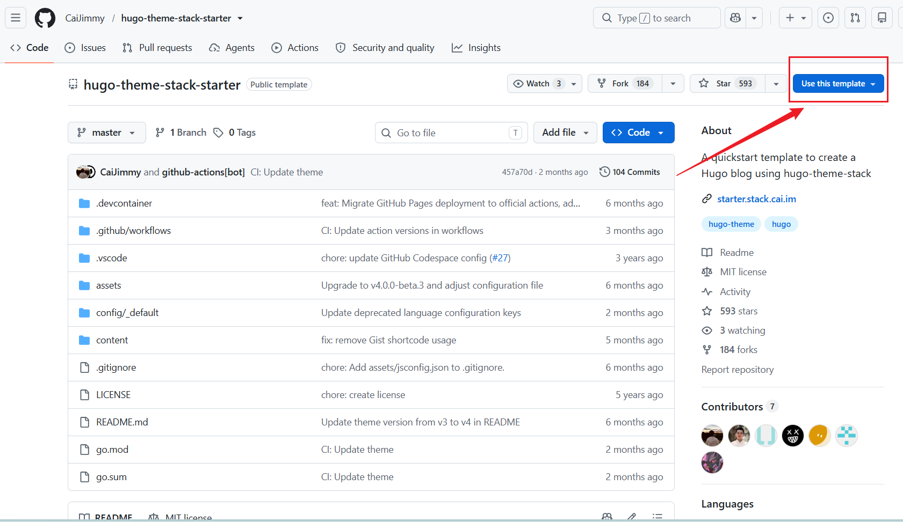
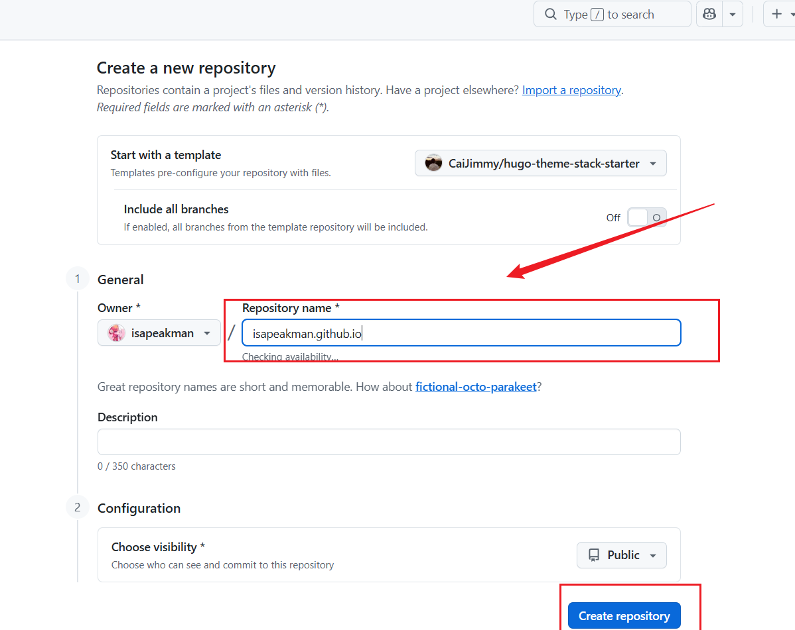
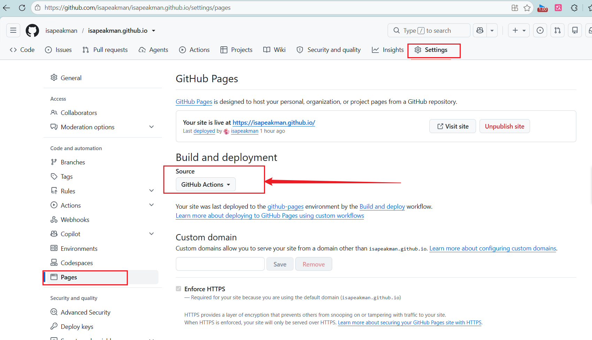
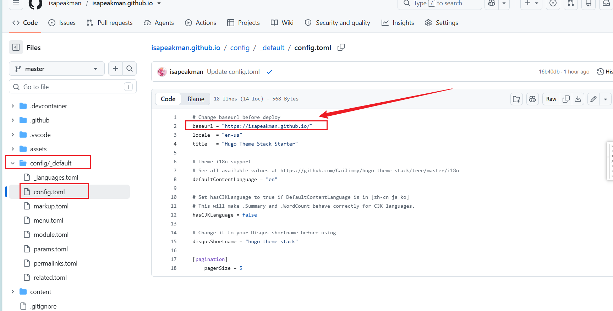
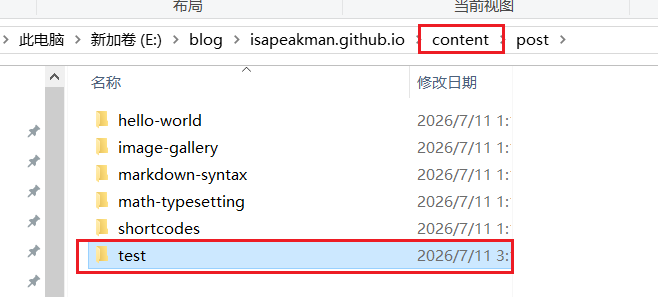
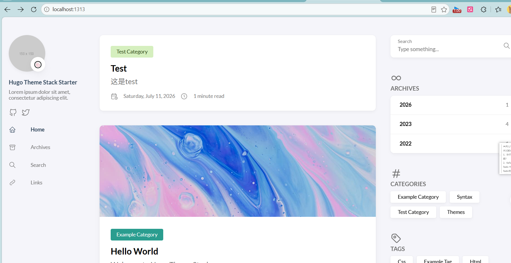

## 环境

Go 官方下载页面：https://go.dev/dl/

Hugo下载地址：[Releases · gohugoio/hugo](https://github.com/gohugoio/hugo/releases)

```
go version
hugo version
```

Go-version：go version go1.26.5 windows/amd64

Hugo-version：hugo v0.164.0

主题 [CaiJimmy/hugo-theme-stack-starter: A quickstart template to create a Hugo blog using hugo-theme-stack](https://github.com/CaiJimmy/hugo-theme-stack-starter)

## 部署过程

1. 创建仓库
   
   1. 基于模板创建
      
      
      
      

2. 确定仓库名：https://<username>.github.io/<repository-name> 也可以直接用 https://<username>.github.io)
   

3. 修改Github Page的部署方式为Actions
   

4. 修改config/_default/config.toml的base Url



4. 在本地部署并编写博客查看效果
   
   1. 拉取代码
   
   2. 在项目根目录运行hugo server -D指令
   
   3. 运行成功后访问 localhost:1313地址
   
   4. 使用命令 hugo new test/test.md 创建文章
      
      
      文章内容：
      
            title: "Test"
            description: 这是test
            date: 2026-07-11T03:10:09+08:00
            image: 
            categories:
                - test Category
            tags:
                - test test test tag
            weight: 1
            math: 
            license: 
            comments: true
            draft: true
            build:
                list: always    # Change to "never" to hide the page from the list
      
      
      文章创建效果：
      

## 常用的Hugo命令

以草稿形式运行
    hugo server -D

以指定端口运行，默认是1313端口
    hugo server -p 1314


## 官方文档

[Stack | Card-style Hugo theme designed for bloggers](https://stack.cai.im/)

### 文章常用参数

    title: 标题
    description: 文章描述，会显示在文章卡片
    slug: hello-world
    date: 2022-03-06 00:00:00+0000
    image: 文章卡片和文章首部显示的图片
    categories:
        - 分类名，能够显示和进行过滤
    tags:
        - 标签，会在文章尾部显示，通常用作相关技术
    weight: 1       # 文章列表的排序权重，1最大，依次排序。权重相同则按日期降序排序。

### 文章常用标签

图片显示

```

```

## 参考文档

[从零到一：使用 Hugo 和 GitHub Pages 搭建个人博客 | jaxiu He](https://blog.jaxiu.cn/blog/2025-07/%E4%BB%8E%E9%9B%B6%E5%88%B0%E4%B8%80%E4%BD%BF%E7%94%A8-hugo-%E5%92%8C-github-pages-%E6%90%AD%E5%BB%BA%E4%B8%AA%E4%BA%BA%E5%8D%9A%E5%AE%A2/)


