## 前言

这篇博文记录 部署一个项目开始到结束用到的Linux命令,目的首先再走一遍经典的部署流程，另外则是熟悉下常用的Linux命令

流程采用window下的wsl+Ubuntu  username: chinese  password: chinese（这里记录下，后面怕会忘）

----

## 第一步：基础环境

当前本地环境是windows下通过WSL实现的子系统Ubuntu

在Ubuntu下

### 1.  更新系统包列表：

```bash
sudo apt update
```

> apt是**Ubuntu 及其衍生发行版** 下的**高级包管理命令行工具**，核心作用是管理软件包——包括查找、安装、升级、卸载软件
>
> ```bash
> sudo apt update               # 刷新本地软件列表（同步远程源信息）
> sudo apt upgrade			  #将所有已安装的包升级到最新版本
> ```

### 2.  安装 Java 运行环境 (JDK)

```bash
# 安装 OpenJDK 17
sudo apt install openjdk-17-jdk -y
# 验证安装
java -version
openjdk version "17.0.19" 2026-04-21                                                                     OpenJDK Runtime Environment (build 17.0.19+10-1-24.04.2-Ubuntu)                                           OpenJDK 64-Bit Server VM (build 17.0.19+10-1-24.04.2-Ubuntu, mixed mode, sharing)  
```

安装位置：`dpkg -L openjdk-17-jdk`

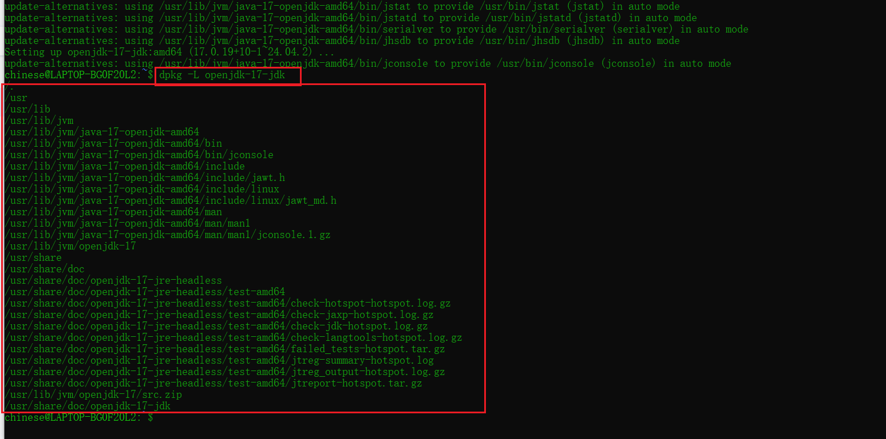

核心内容都在**`/usr/lib/jvm/java-17-openjdk-amd64/`**文件夹中。

> 是否需要配置环境变量：不需要，apt已经在/usr/bin/java、/usr/bin/javac等创建为软链接，并最终指向 JDK 的实际安装目录下的可执行文件（比如/usr/lib/jvm/java-17-openjdk-amd64/bin/java）

### 3. 安装 Nginx

Nginx 作为 Web 服务器和反向代理服务器。

```bash
sudo apt install nginx -y
# 验证安装
nginx -v
nginx version: nginx/1.24.0 (Ubuntu)
```

### 4. 安装数据库 (MySQL)：

查看是否安装过mysql `dpkg -l | grep mysql-server`

- 如果输出以 `ii` 开头（如 `ii mysql-server ...`），说明已经装过了。
- 如果输出以 `rc` 开头，说明配置文件还在，但软件已删除。
- 如果无任何输出，说明未安装。

```bash
# 安装 MySQL 服务器
sudo apt install mysql-server -y
# 安装后建议运行安全脚本
sudo mysql_secure_installation
```

### 5. 安装redis

```bash
# 1. 更新源并安装
sudo apt update
sudo apt install redis-server -y

# 2. 启动 Redis 服务并设为开机自启
sudo systemctl start redis-server
sudo systemctl enable redis-server

# 3. 检查运行状态
sudo systemctl status redis-server

# 4. 测试连接（默认监听 127.0.0.1:6379）
redis-cli ping
# 返回 PONG 即成功
```

#### redis供外部连接

- 配置文件：`/etc/redis/redis.conf`
- 默认只允许本地连接，若需远程访问，需注释 `bind 127.0.0.1`并将`protected-mode` yes改为 no 
- 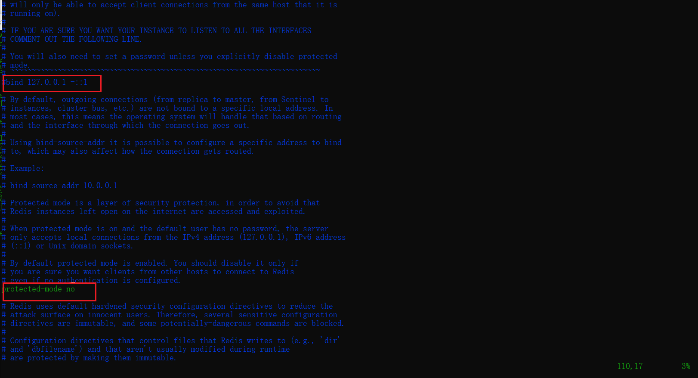

##### 通过windows的cmd连接Redis

`telnet 172.31.19.238 6379`

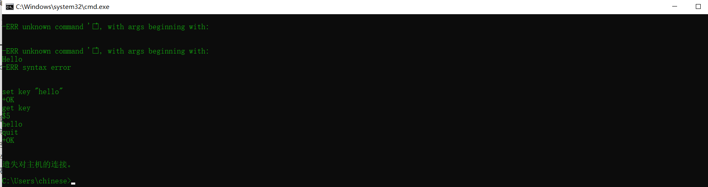

其中 $5表示五个字节的意思

当前窗口使用 `quit`进行退出

##### 通过RedisDesktopManager连接

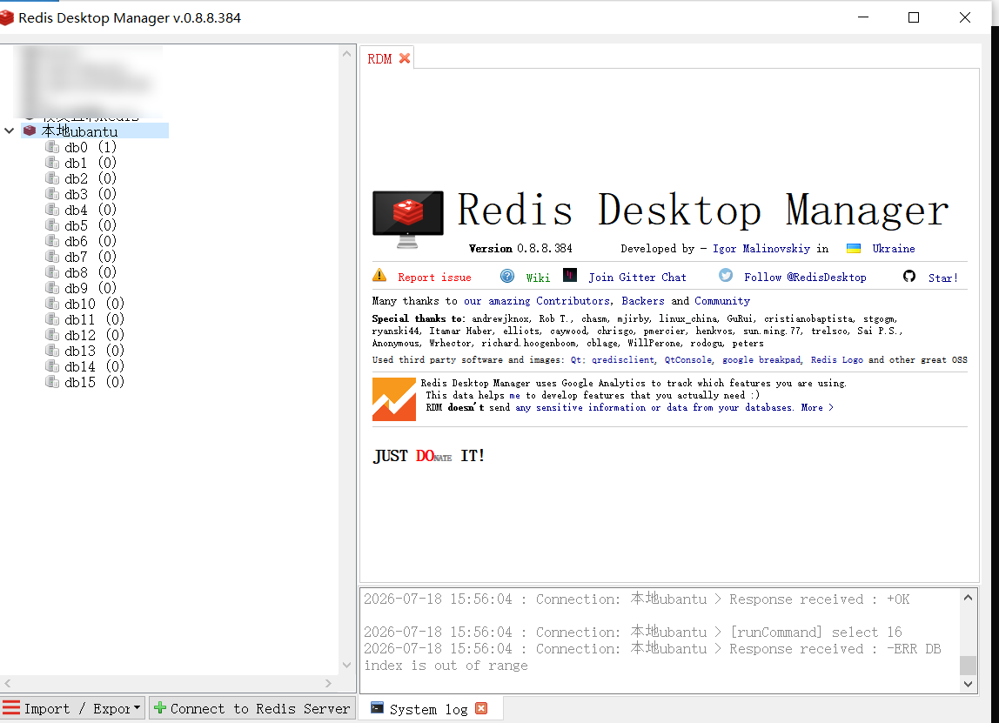

### 6. 安装minio

#### 1. 下载并启动

由于**MinIO 官方并没有将服务器版本提交到 Ubuntu/Debian 的默认 APT 源**，所以使用wget下载

```bash
# 1. 下载最新版 MinIO 二进制（64位 Linux）
wget https://dl.min.io/server/minio/release/linux-amd64/minio
chmod +x minio

# 2. 创建数据目录
sudo mkdir -p /data/minio

# 3. 设置环境变量（凭据）
export MINIO_ROOT_USER=minioadmin
export MINIO_ROOT_PASSWORD=minioadmin

# 4. 启动服务（前台运行，默认 API 端口 9000，控制台端口在启动日志里看）
./minio server /data/minio
# 后台运行命令并将日志输出到minio.log中
nohup ./minio server /data/minio > minio.log 2>&1 &
```

#### 2. 查看minio进程

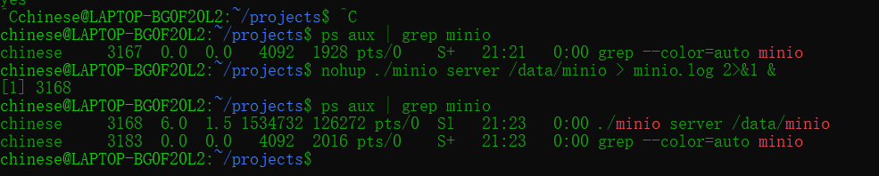

第一条为minio进程，第二条为grep进程。minio的进程号为3168

#### 3. 查看minio端口号

```bash
# 查看所有minio占用端口号，默认为9000
sudo ss -tlnp | grep minio
```

#### 4. 通过windows访问minio客户端页面

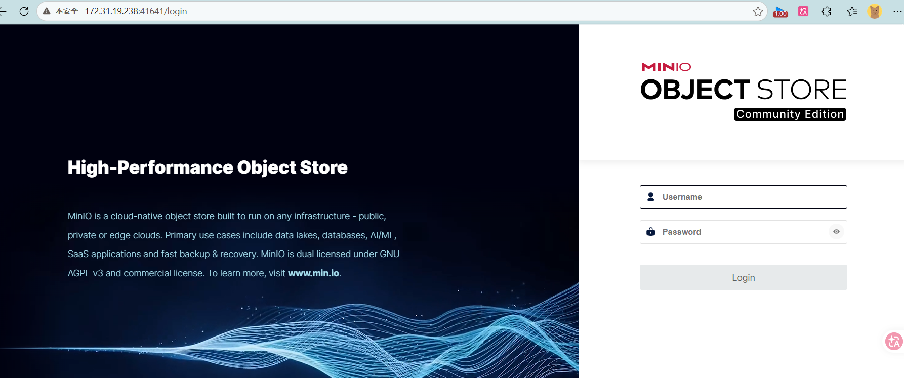

用户名和密码均为 `minioadmin`

#### 5. 可能遇到的文件权限访问问题

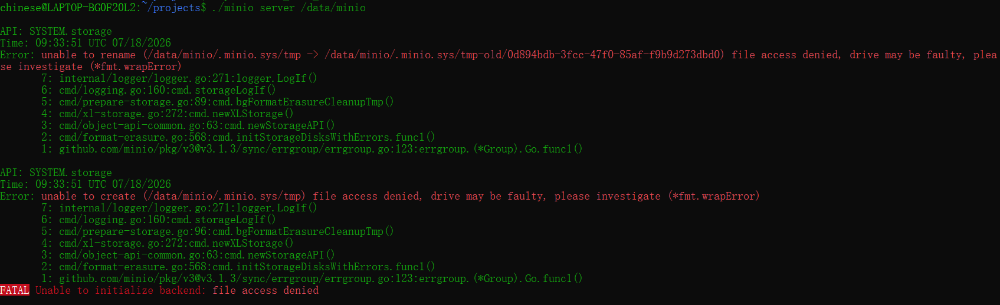

本质上是一个 **文件系统权限问题**：MinIO 进程试图在 `/data/minio/.minio.sys` 下做内部元数据维护（重命名临时目录），但被**拒绝了**。

可以考虑用以下命令：

```bash
sudo chown -R $USER:$USER /data/minio  
# 递归地把 /data/minio 目录及其内部所有文件和子目录的所有者，改为当前用户（并同时更改所属组为当前用户组）
```

执行完后再执行启动命令

### 7. 安装SSH 

ssh用于文件上传，模拟真实的Linux环境，虽然可以让Ubuntu直接访问本地文件

#### 1. 安装并修改SSH配置文件

```bash
sudo apt install openssh-server -y
# 修改 SSH 配置文件
sudo vim /etc/ssh/sshd_config
```

找到 `#PasswordAuthentication yes`，去掉前面的 # 注释，确保它是 yes。表示ssh需要密码授权

修改时可以用 `/`进行搜索 `/PasswordAuthentication`,使用`INSERT`进行修改

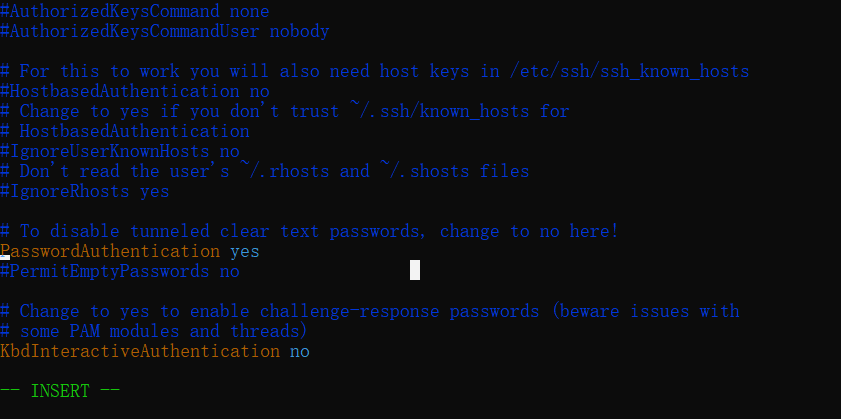

#### 2. 启动SSH服务

```bash
# 启动服务
sudo service ssh start
# 设置为开机自启（如果是 WSL 2，可能需要额外配置，但手动启动也方便）
sudo systemctl enable ssh
```

` sudo systemctl status ssh`查看ssh的状态

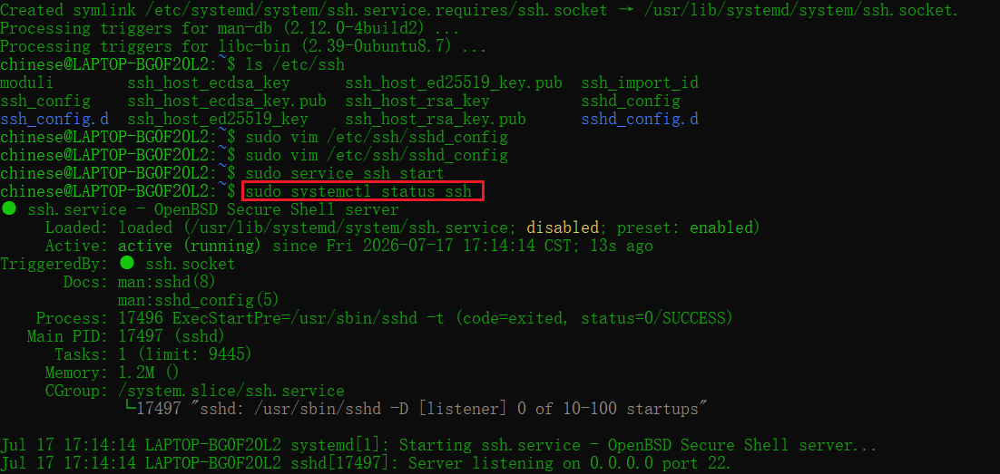

`sudo ss -tlnp | grep :22` 查看端口监听状态

> sudo netstat -tlnp | grep :22 中的`netstat` 命令在某些现代 Linux 发行版中默认不再预装，它被更先进的 `ss` 替代了

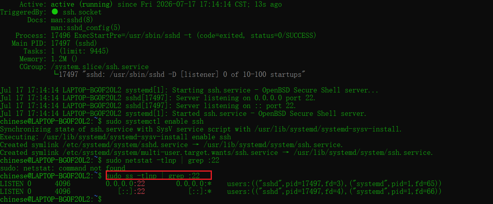


在Windows的cmd窗口进行文件上传

`scp -r dist路径 wsl用户名@地址:文件夹路径`

```bash
scp -r D:\a\alumni-direct\alumni-direct-ui\dist chinese@172.31.19.238:~/projects/frontend
```

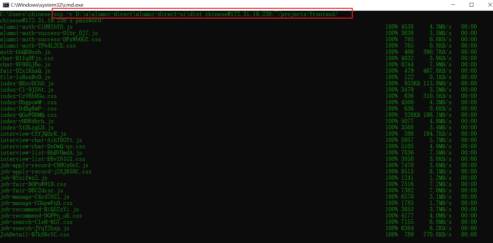

## 第二步：打包并上传项目

### 1. 打包前端项目 (Vue)

1. **在本地构建项目**：
   进入Vue 项目根目录，执行构建命令：

   ```bash
   npm run build
   ```

   构建完成后，会在项目根目录生成一个 `dist` 文件夹，里面包含了所有生产环境的静态文件。

### 2. 在本地打包后端项目(Springboot)：
在 IDEA 或终端中，进入后端项目根目录，执行 Maven 打包命令：

对于common模块需要用 `mvn clean install -DskipTests`跳过`@SpringBootTest`测试并打包安装到本地仓库，后续才能被service模块引用

```bash
mvn clean package -DskipTests
```

成功后，会在 `target/` 目录下生成一个 `.jar` 文件，比如 `myapp-0.0.1-SNAPSHOT.jar`。

> 值得注意的是打包的jar时需要用到spring-boot-maven-plugin插件，这个jar会**包含正确的启动入口信息**。没有该插件打包出来的jar包没有包含入口信息，运行时会出现 `no main manifest attribute`
>
> ```xml
<build>
     <plugins>
         <plugin>
             <groupId>org.springframework.boot</groupId>
             <artifactId>spring-boot-maven-plugin</artifactId>
             <version>2.7.0</version> <!-- 版本号通常由 parent 管理，无需指定 -->
             <executions>
                 <execution>
                     <goals>
                         <goal>repackage</goal>
                     </goals>
                 </execution>
             </executions>
         </plugin>
     </plugins>
 </build>
```
>
> 

### 3. 上传 JAR 包到Linux

Ubuntu在用户主目录（`~`）创建项目文件夹：

```bash
mkdir -p ~/projects/frontend 
mkdir -p ~/projects/backend 
```

在Windows cmd运行命令进行文件上传：

```bash
scp -r D:\a\alumni-direct\alumni-ui\dist chinese@172.31.19.238:~/projects/frontend
scp -r D:\a\alumni-direct\alumni-direct-service\target\alumni-direct-service-0.0.1-SNAPSHOT.jar chinese@172.31.19.238:~/projects/backend
```

## 第三步：配置 Nginx运行前端项目

这是连接前后端的关键。Nginx 需要做两件事：一是找到前端页面，二是把 API 请求转交给后端 Java 程序。

### 1. 编辑 Nginx 配置文件：

```bash
sudo vim /etc/nginx/sites-available/default
```

将文件内容修改或替换为以下配置。**将路径和域名替换**。

```nginx
server {
    listen 80;                          # 监听 80 端口
    server_name your-domain.com;        # 替换为域名或服务器 IP

    # 前端静态文件配置
    location / {
        root /home/your-username/projects/frontend/dist; # 替换 dist 实际路径
        index index.html;
        try_files $uri $uri/ /index.html; # 解决 Vue Router 的 history 模式刷新 404 问题[reference:18]
    }

    # 后端 API 反向代理配置
    location /api/ {                    # 前端请求的 API 前缀
        proxy_pass http://127.0.0.1:8080/; # 假设后端运行在 8080 端口[reference:19]
        proxy_set_header Host $host;
        proxy_set_header X-Real-IP $remote_addr;
        proxy_set_header X-Forwarded-For $proxy_add_x_forwarded_for;
    }
}
```

### 2. 测试并重载 Nginx：

```bash
# 测试配置文件语法是否正确[reference:20]
sudo nginx -t      
语法正确输出：
nginx: the configuration file /etc/nginx/nginx.conf syntax is ok                       
nginx: configuration file /etc/nginx/nginx.conf test is successful 
# 如果显示 successful，则重载 Nginx 使配置生效[reference:21]
sudo systemctl reload nginx
```

如果此时访问，会发现500错误

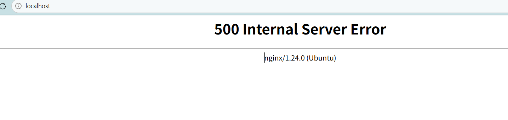

### 3. 使Nginx 能读取/dist

- **Nginx无法读取到/dist原因**

Nginx 默认以 `www-data` 用户和用户组运行。而前端文件 (`dist`) 位于用户 `chinese` 的主目录下，默认权限是 `750` (即 `rwxr-x---`)，这意味着 `www-data` 用户**无法进入** `/home/chinese/` 目录，更别说读取其子目录下的文件了

> `www-data` 是 **Ubuntu / Debian 系统中，Web 服务器默认使用的系统用户**。当安装 Nginx 或 Apache 时，它们的工作进程会以这个用户的身份运行。

- **转移/dist文件夹到nginx的存放文件目录下**

```bash
sudo mv ~/projects/frontend /var/www/html/alumni-frontend 
```

- **重新配置并重启**

重新配置nginx文件： root /var/www/html/alumni-frontend/dist;

重启nginx 后在windows访问  `172.31.19.238:80`即可访问


## 第四步：数据库脚本运行

这里可以通过可视化工具 `datagrip`或者 `navicat`又或者 `idea`连接数据库，从而建好库表之类的。但本次采用导入sql脚本到Ubuntu直接去执行脚本

### 1. 导出SQL脚本

使用idea导出对应的sql脚本，点击库，选择 **export with mysqldump**

可以在资源管理器找到mysqld.exe后查找文件地址从而找到本地Mysql的安装目录

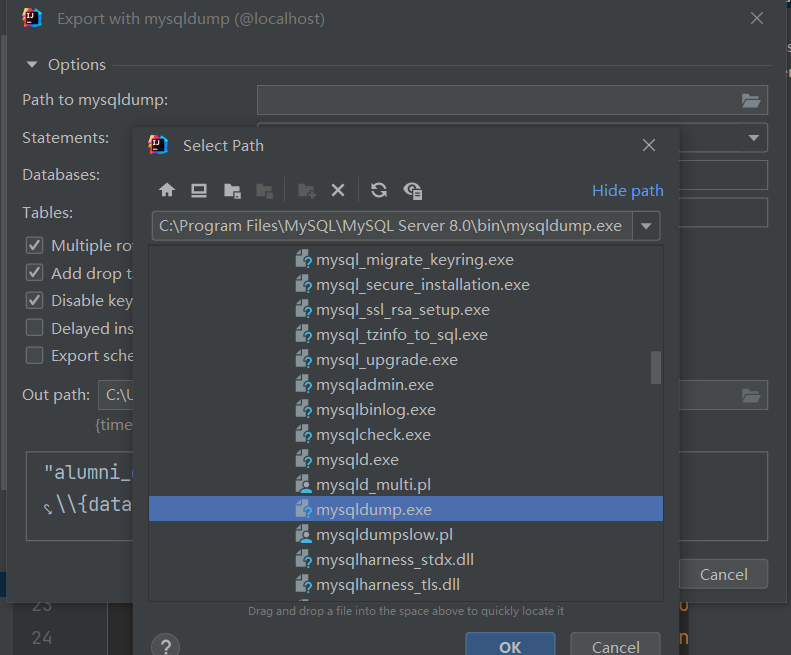

`Out path`导出路径最好写上文件名，不然可能会显示

`mysqldump: Can't create/write to file 'C:\Users\chinese' (OS errno 13 - Permission denied)`这样的错误

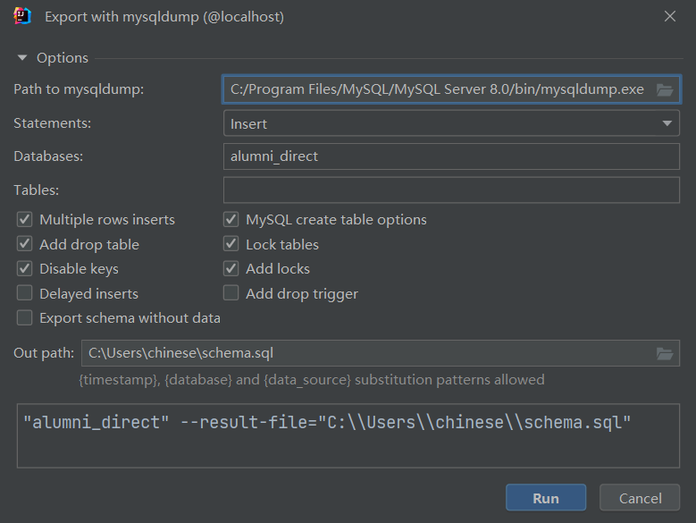

上传文件后 `scp C:\Users\chinese\schema.sql chinese@172.31.19.238:~/projects/sql/`

### 2. 执行SQL脚本

登录Mysql

```bash
sudo mysql -u root -p
```

修改密码：

```sql
ALTER USER 'root'@'localhost' IDENTIFIED WITH mysql_native_password BY '123456'; 
```

导出的SQL文件是没有建库语句的，在执行脚本前要先建库：

```sql
CREATE DATABASE IF NOT EXISTS alumni_direct;
USE alumni_direct;
```

运行SQL：

```sql
SOURCE /home/chinese/projects/sql/schema.sql;
```

## 第五步：后端项目部署(SpringBoot)

一个nginx只能部署一个前端项目？

### 1. 基于命令启动后端项目

```bash
java -jar alumni-direct-service-0.0.1-SNAPSHOT.jar  \
  --spring.datasource.url=jdbc:mysql://localhost:3306/yourdb \
  --spring.datasource.username=root \
  --spring.datasource.password=密码 \
  --spring.redis.host=localhost \
  --spring.redis.port=6379
```

不过由于当前项目本身拥有配置文件 `application-local.yml` 且配置项较多，采用基于配置文件运行

### 2. ⭐基于配置文件运行

```bash
java -jar alumni-direct-service-0.0.1-SNAPSHOT.jar --spring.profiles.active=local
```

> - `application.yml` (基础公共配置)
> - `application-local.yml`：本地环境
> - `application-dev.yml`：开发环境
> - `application-test.yml`：测试环境
> - `application-staging`：灰度环境 
> - `application-prod.yml`:生产环境
>
> 在部署时，通过 `--spring.profiles.active` 参数来指定，如 `--spring.profiles.active=test`。这样，Spring Boot 就会加载 `application.yml` 和 `application-test.yml` 中的配置，且**后者会覆盖前者的同名配置**

项目启动成功

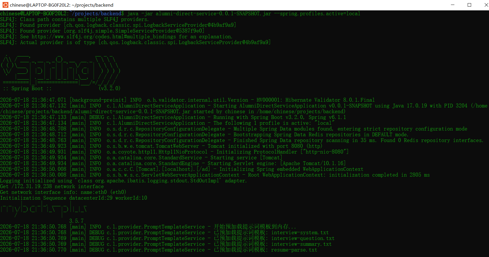

----

## 管理与监控

### 项目配置为 systemd 服务

#### systemd服务的优点

systemd 服务就是把一个应用程序（比如 Spring Boot JAR 包）包装成一个可以被操作系统管理的“服务”。可以通过 `systemctl` 命令来控制它的**启动、停止、重启、开机自启**等生命周期

- **开机自启**：服务器重启后，Java 应用会自动启动，无需手动干预。
- **统一管理**：可以像管理 Nginx、MySQL 一样，用 `systemctl start/stop/status` 命令来管理应用。
- **日志集成**：服务的标准输出日志会被 systemd 自动捕获，可以通过 `journalctl` 命令方便地查看。
- **进程守护**：即使 JAR 包意外崩溃，systemd 也可以配置为自动重启（需要额外设置）。

#### 将后端项目配置为Systemd服务

```bash
sudo vim /etc/systemd/system/alumni-backend.service
```

```ini
[Unit]
Description=Alumni Directory Backend Service
After=network.target mysql.service redis.service
Requires=mysql.service redis.service

[Service]
Type=simple
User=chinese
WorkingDirectory=/home/chinese/projects/backend
ExecStart=/usr/bin/java -Xms256m -Xmx512m -jar /home/chinese/projects/backend/alumni-direct-service-0.0.1-SNAPSHOT.jar --spring.profiles.active=local
Restart=on-failure
RestartSec=10
StandardOutput=journal
StandardError=journal

[Install]
WantedBy=multi-user.target
```

配置项说明：

- `After` 和 `Requires`：声明服务在**网络、MySQL、Redis** 之后启动，并依赖它们（依赖项启动失败则本服务不启动）。
- `User`：指定以哪个系统用户运行，**建议用普通用户名**，而不是 `root`。
- `WorkingDirectory`：JAR 包所在的目录
- `ExecStart`：**启动命令**，等同于手动执行的命令，但更完整。
- `Restart`：`on-failure` 表示如果进程异常退出（非正常退出码），系统会自动重启。
- `RestartSec`：自动重启前的等待时间（秒）。
- `StandardOutput` 和 `StandardError`：将输出交给 `journalctl` 管理。**将服务的标准输出（stdout）和标准错误（stderr）直接交给 systemd 的日志系统（journal）来统一管理**。它们并不会直接写入某个固定的文件，而是将日志内容发送到 systemd 的日志收集服务中。通过 `journalctl` 命令来集中查看。
- `WantedBy=multi-user.target`：系统启动到“多用户模式”时，服务自动启动

#### 启动后端项目的systemd服务

```bash
sudo systemctl daemon-reload  # 重新加载 systemd 配置，让它识别新文件
sudo systemctl start alumni-backend   # 启动
sudo systemctl stop alumni-backend    # 停止
sudo systemctl restart alumni-backend # 重启
sudo systemctl status alumni-backend  # 查看状态和最近日志
sudo systemctl enable alumni-backend  # 开启开机自启
sudo systemctl disable alumni-backend # 关闭开机自启

# 查看完整日志
sudo journalctl -u alumni-backend -f
sudo journalctl -u alumni-backend --no-pager # 一次性输出所有内容到终端，不分页
```

#### journalctl日志能否保证持久化

查看是否存在文件

```bash
ls -l /var/log/journal/            

输出内容：
total 4     # 四个字节                                                                                       
drwxr-sr-x+ 2 root systemd-journal 4096 Jul 19 14:42 735702d0f62642098c9931f52aedd603 
```

**所有systemd服务的日志（alumni-backend、minio、nginx、mysql、redis）都会被统一记录在这个目录下**,无法直接查看文件内容。

#### 将minio也systemd服务化

```bash
sudo vim /etc/systemd/system/minio.service
```

```ini
[Unit]
Description=MinIO Object Storage Server
After=network.target
Wants=network.target

[Service]
Type=simple
User=chinese
Group=chinese
WorkingDirectory=/home/chinese/projects
ExecStart=/home/chinese/projects/minio server /data/minio
Restart=on-failure
RestartSec=10
StandardOutput=journal
StandardError=journal

[Install]
WantedBy=multi-user.target
```

```bash
# 重新加载 systemd 配置
sudo systemctl daemon-reload
# 立即启动 MinIO
sudo systemctl start minio
# 设置开机自启
sudo systemctl enable minio
# 查看服务状态
sudo systemctl status minio
sudo journalctl -u minio -f   # 查看实时日志
```

#### 查询所有的systemd服务及运行状态⭐

```bash
systemctl list-units --type=service --all | grep -E 'alumni|minio|nginx|mysql|redis'
```

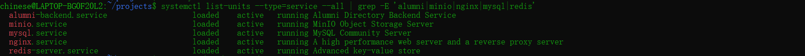

### 项目输出日志文件⭐

#### 命令行运行方式

```bash
nohup java -jar your-app.jar \
  --spring.profiles.active=local \
  --logging.file.path=/home/chinese/logs/ \
  --logging.logback.rollingpolicy.file-name-pattern="/home/chinese/logs/backend/spring.%d{yyyy-MM-dd}.%i.log" \
  --logging.logback.rollingpolicy.max-file-size=100MB \
  --logging.logback.rollingpolicy.max-history=30 \
  --logging.logback.rollingpolicy.total-size-cap=2GB
```

- `file-name-pattern`：定义日志文件的命名规则。`%d{yyyy-MM-dd}` 实现按天分割，`%i` 是序号。
- `max-file-size`：单个文件达到此大小时触发轮转。
- `max-history`：保留最近 30 天的日志。
- `total-size-cap`：所有日志文件总大小上限，防止磁盘被写满。

#### systemd服务日志文件

##### 第一种：修改里面的执行命令

```ini
[Unit]
Description=Alumni Directory Backend Service
After=network.target mysql.service redis.service
Requires=mysql.service redis.service

[Service]
Type=simple
User=chinese
Group=chinese
WorkingDirectory=/home/chinese/projects/backend
ExecStart=/usr/bin/java -Xms256m -Xmx512m -jar /home/chinese/projects/backend/alumni-direct-service-0.0.1-SNAPSHOT.jar \
  --spring.profiles.active=local \
  --logging.file.path=/var/log/alumni-backend \
  --logging.logback.rollingpolicy.file-name-pattern="/var/log/alumni-backend/app.%d{yyyy-MM-dd}.%i.log" \
  --logging.logback.rollingpolicy.max-file-size=100MB \
  --logging.logback.rollingpolicy.max-history=30 \
  --logging.logback.rollingpolicy.total-size-cap=2GB
Restart=on-failure
RestartSec=10
StandardOutput=journal
StandardError=journal

[Install]
WantedBy=multi-user.target
```

##### 第二种：将journal改为日志文件输出

```ini
StandardOutput=file:/var/log/alumni-backend/out.log
StandardError=file:/var/log/alumni-backend/err.log
```

缺点是无法按天/大小拆分，文件会不断追加。

### 项目启动和组件部署脚本⭐

先开启免密登录和允许用户chinese的systemctl执行，这样输入一次密码后，后续 `scp` 和 `ssh` 就不再需要密码了。后面脚本执行也就无需密码登录。

#### 开启ssh免密登录

```bash
ssh-keygen -t rsa -b 4096  # 创建公钥和私钥
```

输入存私钥和公钥的文件名可以直接回车，默认会存储在 `Users/用户/.ssh/id_rsa`,若输入了文件名则在命令行当前目录创建公钥和私钥文件。我的目录多出了 `keyFile`（私钥）和 `keyFile.pub`（公钥）文件

要求输入的`passphrase`也可以直接回车，也就是私钥文件的密码为空即可。

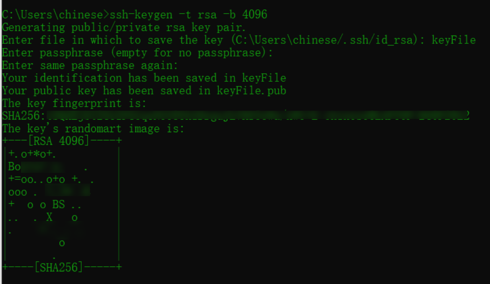

将公钥内容追加到远程服务器的 `~/.ssh/authorized_keys` 文件中：

```bash
ssh-copy-id chinese@172.31.19.238
```

**由于Windows下的cmd和powershell没有ssh-copy-id命令，不过可以使用git bash窗口，它本身就可以模拟Linux系统**

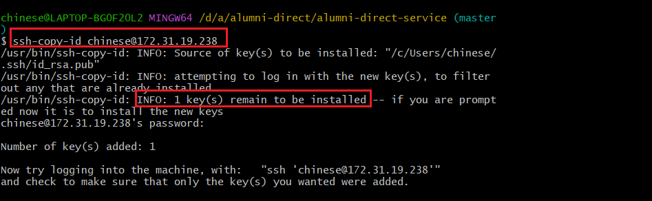

之后可以通过cmd/posershell/git bash都可以免密登录成功

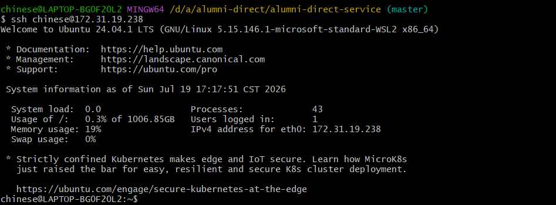

#### 配置 `sudoers` 以允许免密执行

进入Ubuntu，执行`sudo visudo`

添加以下一行内容：（允许chinese用户免密执行systemctl）

```ini
chinese ALL=(ALL) NOPASSWD: /usr/bin/systemctl
```

执行 `systemctl`查看是否生效，无需密码

```bash
sudo systemctl status alumni-backend
```

#### 编写脚本

在项目的根目录下创建 `deploy.ps1`文件，包含**构建项目、上传jar到Linux、检查依赖服务启动情况、重启服务**。

```powershell
# deploy.ps1
# 说明：本脚本用于在 Windows 本地打包并部署 Spring Boot 项目到远程 Linux 服务器

# 设置脚本执行策略（仅在当前会话有效，允许脚本运行）
Set-ExecutionPolicy -Scope Process -ExecutionPolicy Bypass -Force

# ----- 配置变量（请根据实际情况修改）-----
$RemoteHost = "172.31.19.238"           # 远程服务器 IP
$RemoteUser = "chinese"                 # SSH 用户名
$RemotePath = "/home/chinese/projects/backend"  # 远端部署目录
$ServiceName = "alumni-backend"         # systemd 服务名
$JarName = "alumni-direct-service-0.0.1-SNAPSHOT.jar"
$LocalJarPath = "target\$JarName"       # 本地 JAR 包路径（相对于脚本执行目录）
$DependencyServices = @("redis-server", "minio")  # 依赖的服务列表 redis和minio
# ----- 配置变量结束 -----

Write-Host ">>> 1. 开始构建项目..." -ForegroundColor Cyan
mvn clean package -DskipTests
if ($LASTEXITCODE -ne 0) {
    Write-Host "错误：Maven 构建失败。" -ForegroundColor Red
    exit 1
}

# 检查 JAR 包是否存在
if (-not (Test-Path $LocalJarPath)) {
    Write-Host "错误：找不到 JAR 包文件 $LocalJarPath" -ForegroundColor Red
    exit 1
}

Write-Host ">>> 2. 上传 JAR 包到远程服务器..." -ForegroundColor Cyan
scp $LocalJarPath "${RemoteUser}@${RemoteHost}:${RemotePath}/"
if ($LASTEXITCODE -ne 0) {
    Write-Host "错误：文件上传失败。" -ForegroundColor Red
    exit 1
}

Write-Host ">>> 3. 检查并启动依赖服务..." -ForegroundColor Cyan
foreach ($svc in $DependencyServices) {
    Write-Host "  检查服务: $svc"
    # 检查服务是否活跃（运行中）
    $status = ssh "${RemoteUser}@${RemoteHost}" "systemctl is-active $svc"
    if ($status.Trim() -ne "active") {
        Write-Host "  服务 $svc 未运行，正在启动..." -ForegroundColor Yellow
        ssh "${RemoteUser}@${RemoteHost}" "sudo systemctl start $svc"
        if ($LASTEXITCODE -ne 0) {
            Write-Host "  错误：启动服务 $svc 失败。" -ForegroundColor Red
            exit 1
        }
        # 启动后等待1秒让服务稳定
        Start-Sleep -Seconds 1
    } else {
        Write-Host "  服务 $svc 已在运行。" -ForegroundColor Green
    }
}

Write-Host ">>> 4. 重启后端服务..." -ForegroundColor Cyan
ssh "${RemoteUser}@${RemoteHost}" "sudo systemctl restart $ServiceName"
if ($LASTEXITCODE -ne 0) {
    Write-Host "错误：重启服务失败。" -ForegroundColor Red
    exit 1
}

Write-Host ">>> 5. 检查服务状态..." -ForegroundColor Cyan
ssh "${RemoteUser}@${RemoteHost}" "sudo systemctl status $ServiceName --no-pager"

Write-Host ">>> 部署完成！" -ForegroundColor Green
```

#### 运行脚本

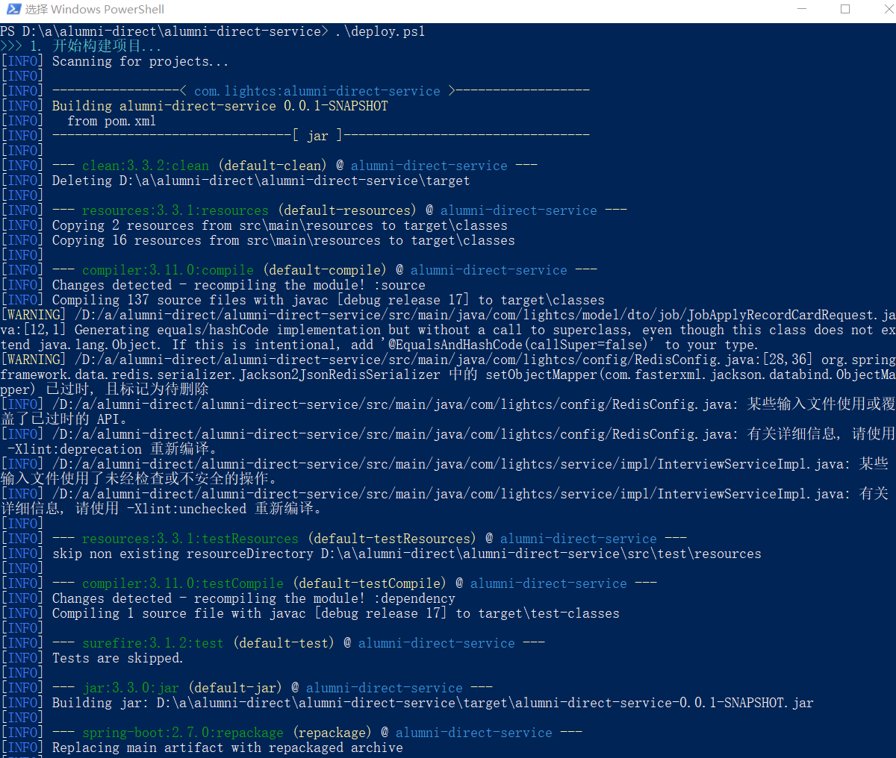

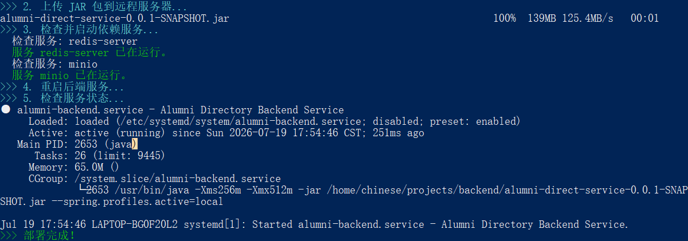


### 监控

#### 查看IP地址

```bash
ip addr show eth0 | grep inet    # 在WSL中查看IP地址
ifconfig                         # 传统Linux系统查看网络配置
hostname -I                      # 快速查看所有网络接口的IPv4地址
```

#### 进程查询⭐

```bash
ps aux          # 显示所有用户的所有进程，BSD 风格
ps -ef          # 显示所有进程，Unix 风格
ps -ef | grep nginx   # 结合 grep 过滤特定进程
ps -ef | grep java    # 查询Java进程
ps aux --sort=-%cpu   # 按CPU使用率倒序输出
ps aux --sort=-%mem   # 按内存使用率倒序输出
pgrep nginx           # 返回匹配进程的 PID
pidof nginx           # 返回进程的 PID（精确匹配可执行文件名）
```

#### 系统资源监控⭐

```bash
top              # 实时监控进程的CPU、内存占用（按P排序CPU，M排序内存，q退出）
htop             # top的增强版（需安装：sudo apt install htop）
free -h          # 查看内存使用情况（-h 人类可读格式）
df -h            # 查看磁盘空间使用情况
df -h /          # 查看根目录磁盘空间
du -sh .         # 查看当前目录总大小
du -h --max-depth=1 .  # 查看当前目录下各文件/文件夹大小
vmstat           # 查看CPU、内存、IO等系统状态
iostat           # 查看磁盘IO使用情况（需安装sysstat）
uptime           # 查看系统运行时间和负载
```

#### 查看应用占用的端口号

```bash
# 查看所有监听中的 TCP 端口
sudo ss -tlnp
# 过滤特定服务
sudo ss -tlnp | grep minio
# 或指定端口
sudo ss -tlnp | grep :9000
sudo ss -tlnp | grep java
# 查看特定进程占用的端口
sudo lsof -i -P | grep java
```

#### 日志文件查看命令⭐

```bash
tail -f app.log           # 实时跟踪日志文件（按Ctrl+C退出）
tail -n 100 app.log       # 查看最后100行日志
head -n 50 app.log        # 查看前50行日志
cat app.log               # 查看整个文件内容
cat app.log | grep ERROR  # 过滤包含ERROR的行
cat app.log | grep -i error  # 忽略大小写过滤
less app.log              # 分页查看文件（按q退出，/搜索）
more app.log              # 分页查看文件（按空格翻页）
grep "关键词" app.log      # 在日志文件中搜索关键词
grep -A 5 "关键词" app.log # 显示匹配行及后面5行
grep -B 5 "关键词" app.log # 显示匹配行及前面5行
grep -C 5 "关键词" app.log # 显示匹配行及前后各5行
```

#### 文件上传与下载

```bash
# 从本地上传到远程服务器
scp local_file.txt user@server_ip:/remote/path/
scp -r local_dir user@server_ip:/remote/path/

# 从远程服务器下载到本地
scp user@server_ip:/remote/path/file.txt ./
scp -r user@server_ip:/remote/path/dir ./

# 使用rsync同步（增量传输，更高效）
rsync -avz local_dir user@server_ip:/remote/path/
```

#### 文件管理

```bash
ls -la           # 查看当前目录详细信息（含隐藏文件）
ls -lh           # 查看文件大小（人类可读格式）
cd /path/to/dir  # 切换目录
pwd              # 显示当前工作目录
mkdir -p dir/subdir  # 创建多级目录
rm -f file.txt   # 强制删除文件
rm -rf dir       # 递归强制删除目录及内容
cp file.txt /path/   # 复制文件
cp -r dir /path/     # 递归复制目录
mv old.txt new.txt   # 重命名文件
mv file.txt /path/   # 移动文件
touch new.txt    # 创建空文件
find /path -name "*.log"  # 查找文件
```

#### 文件编辑常用操作

```bash
vim file.txt     # 使用vim编辑文件
# vim常用操作：
# i       # 进入插入模式
# Esc     # 退出插入模式
# :w      # 保存
# :q      # 退出
# :wq     # 保存并退出
# :q!     # 强制退出不保存
# /keyword # 搜索关键词（按n查找下一个，N查找上一个）
# :%s/old/new/g # 全局替换

nano file.txt    # 使用nano编辑文件（更简单）
```

### 权限管理

```bash
-rwxr-xr-x
```

拆成四段：

| 第1位             | 第2-4位    | 第5-7位    | 第8-10位   |
| :---------------- | :--------- | :--------- | :--------- |
| `-` 文件 `d` 目录 | 拥有者权限 | 同组人权限 | 其他人权限 |

```bash
7 = 读(4) + 写(2) + 执行(1) = rwx
5 = 读(4) + 执行(1)         = r-x
0 = 啥都没有                  = ---
```

三个数字分别代表**拥有者、同组、其他人**：

```bash
chmod 755 文件名         # 设置权限为 rwxr-xr-x
chmod 644 文件.txt       # 设置文件权限为 rw-r--r--（常用）
chmod 777 目录名         # 所有用户都有全部权限（慎用）
chmod -R 755 目录名      # 递归设置目录及所有子文件权限
chown user:group 文件    # 修改文件所有者和所属组
chown -R user:group 目录 # 递归修改目录所有者和所属组
chgrp group 文件         # 仅修改文件所属组
ls -la                  # 查看文件详细权限信息
```

> **注意**：`x` 权限对于文件夹来说，表示能否 `cd` 进入该目录以及查看其中的文件。如果没有 `x` 权限，即使有 `r` 权限也无法查看目录内容。

## 参考文档

[企业项目常见部署方式全梳理：从安装、启动、托管到发布一次讲清_公司都是怎么项目部署的-CSDN博客](https://blog.csdn.net/m0_57021623/article/details/159247016)
