## 使用Github page创建个人博客的步骤

主要步骤：

1. 本地部署Hugo+BlowFish项目
   
   * 在本地使用 开源的Hugo前端项目，引入美观的前端主题
   
   * 本地测试没问题

2. Github创建仓库，仓库开放 用户名.github.io地址

3. 将 本地博客的文件（.md文件转换后生产的/public下的html文件）提交到远程仓库

## 本地部署Hugo&BlowFish

### 安装Hugo环境

#### 下载

Hugo是一个用GO语言开发的静态页面的生成器，在我看来就是可以将md格式的文件 转换为 html文件，其优点就是转换的速度快。详情可以查看官方说明[Hugo.Github地址](https://github.com/gohugoio/hugo/)

选择下载Hugo-release时建议下载扩展版，博主下载的是[hugo_extended_0.147.1_windows-amd64.zip]([Release v0.147.1 · gohugoio/hugo](https://github.com/gohugoio/hugo/releases/tag/v0.147.1))

#### 配置环境变量

1. 将下载后的压缩包解压到合适的位置，比如：D:Hugo

2. 之后复制 `hugo.exe`所在的目录路径，比如：`D:\Hugo`

3. 将复制的路径在环境变量的path中进行配置，如图所示:

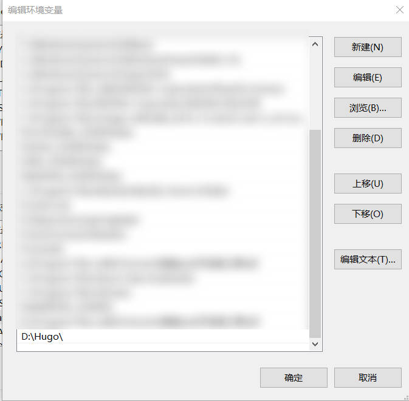

4. 运行`hugo version`命令，查看当前的hugo版本

命令行输出以下内容，安装成功

```shell
hugo v0.147.3-05417512bd001c0b2cc0042dcc584575825b89b3+extended windows/amd64 BuildDate=2025-05-12T12:25:03Z VendorInfo=gohugoio
```

### 创建站点(site)

1. 选择一个存放  博客 的目录，创建站点

```shell
hugo new site <site-name>
# 示例
hugo new site blog
```

可以查看到创建的站点文件夹

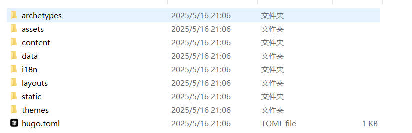

暂时比较重要的目录：

- content: 存放文章

- themes: 存放主题

- hugo.toml: 站点配置文件

### 安装blowfish主题

1. 切换到站点根目录，初始化仓库并将blowfish作为子模块嵌入到当前目录

```shell
git init -b main
git submodule add -b main https://github.com/nunocoracao/blowfish.git themes/blowfish
```

2. 切换到`themes/blowfish` ，复制`archetypes`和`config`目录，替换站点根目录的`archetypes`和`config`

3. 进入到`config/_default`文件夹中，将`languages.en.toml`、`menus.en.toml`两个文件中间的`en`改为你的默认语言，例如`languages.zh-cn.toml`、`menus.zh-cn.toml`

4. 进入到`config/_default`文件夹中，对`hugo.toml`文件编辑
- `baseURL`: 域名

- `defaultContentLanguage`: 默认语言

- `hasCJKLanguage`: 开启汉字计数 

```shell
# -- Site Configuration --
# Refer to the theme docs for more details about each of these parameters.
# https://blowfish.page/docs/getting-started/
theme = "blowfish" # UNCOMMENT THIS LINE
baseURL = "https://isapeakman.github.io"
defaultContentLanguage = "zh-cn"

hasCJKLanguage = true  
# Other configuration options...
```

5. 在站点根目录运行`hugo server -D` 启动服务器,访问`localhost:1313`，运行成功如图

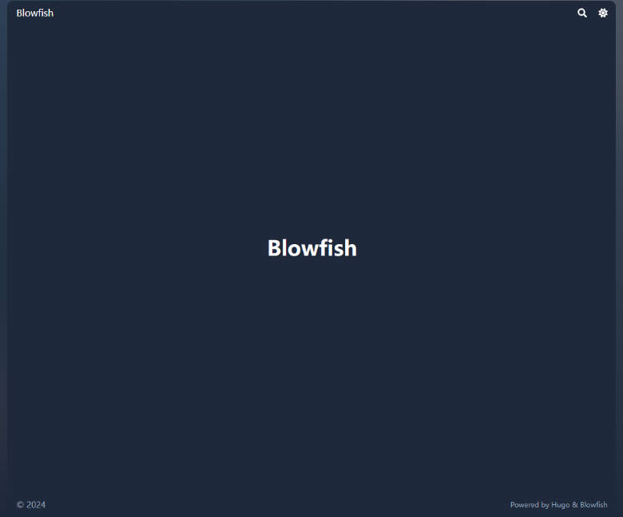

### 配置站点

`languages.zh-cn.toml`配置如下

```shell
disabled = false
languageCode = "zh-cn"
languageName = "Simplified Chinese (China)"
weight = 1
title = "▲のBlog"

[params]
  displayName = "简体中文"
  isoCode = "cn"
  rtl = false
  dateFormat = "2006 年 1 月 2 日"
  logo = "img/logo.png"
  # secondaryLogo = "img/secondary-logo.png"
  description = "My awesome website"
  copyright = "© 2025 - { year } peak~ん All Rights Reserved."

[params.author]
  name = "peak~ん"
#   email = "youremail@example.com"
  image = "img/blowfish_logo.png"
#   imageQuality = 96
  headline = "I'm only human"
  bio = "A little bit about you"
  links = [
    { 163music = "https://music.163.com/#/us
er/home?id=541376277" },
]
```

`menus.zh-cn.toml`配置如下

```shell
[[main]]
  name = "Home"
  pageRef = "/"
  weight = 10

[[main]]
  name = "Posts"
  pageRef = "posts"
  weight = 20

[[main]]
  name = "Categories"
  pageRef = "categories"
  weight = 30

[[main]]
  name = "Tags"
  pageRef = "tags"
  weight = 40
```


### 创建文章

- 在站点根目录运行`hugo new posts/first-post.md`从而根据Hugo的规范在/content/posts创建一个.md文件，文件的格式如下(文章的创建可能需要 服务器关闭才能创建，否则会卡住)

```shell
date = '2025-05-16T21:15:11+08:00'
draft = true
title = 'First Post'
```

分别是创建时间、是否为草稿、文章标题.

- 可以在下面书写文字内容，如下图所示：

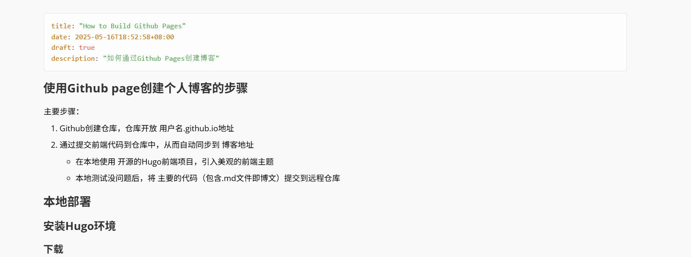

- 显示图片：
  
  - 将图片和文章(.md)放在一个新的文件夹中， 作为博客的整体
  
  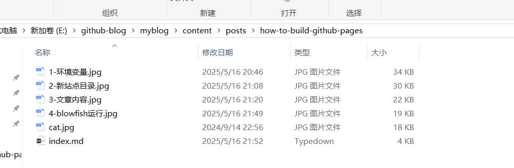
  
  - 在.md文件中可以用``显示图片，如果要控制图片尺寸，可以用`"`

- 在服务器运行的情况下，可以 `enter`回车 刷新 站点，当然其本身就会自动刷新。

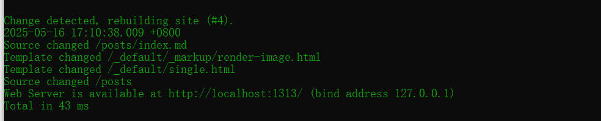


- 访问浏览器 `localhost:1313/posts`，查看文章展示效果(需要注意的是`hugo server -D`则会渲染草稿，而`hugo server`则不会渲染草稿，当发现文章没有渲染出来极大可能是该原因，可以将文章设置为`draft: false`)

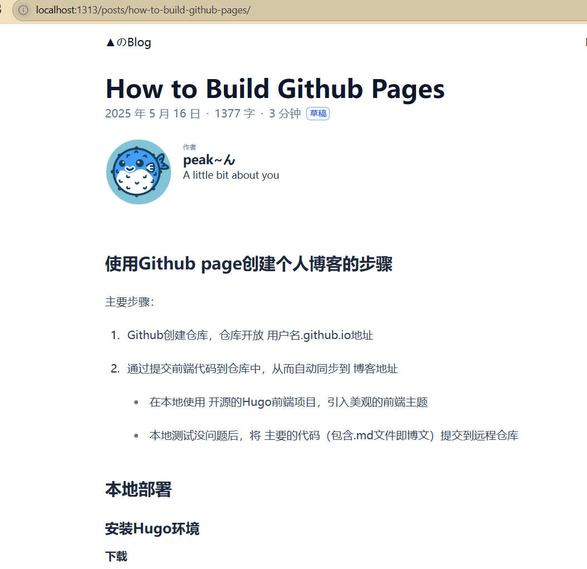

## 远程部署

### 创建仓库

1. 创建一个新仓库后，点击`Setting`设置

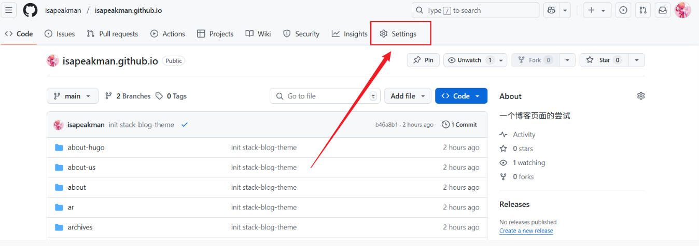

2. 点击左侧的Pages设置，查看博客地址和同步显示的代码分支无误

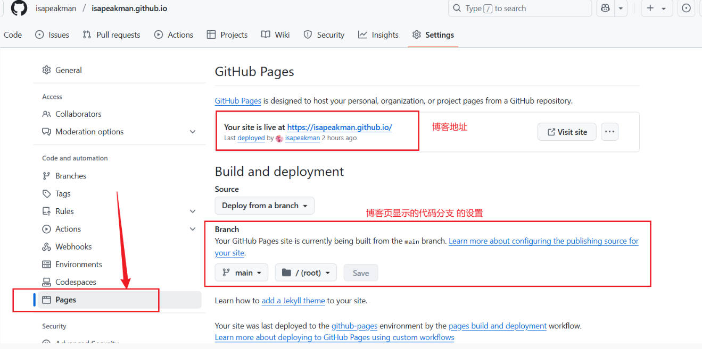

### 关联仓库推送代码

可能使用到的git指令

查看关联的远程仓库 ： `git remote -v` 

初始化远程仓库 `git init -b main` #初始化本地分支

关联远程仓库：` git remote add https://github.com/original/repo.git`

拉取仓库代码： `git pull --rebase origin main`

保存到暂存区：`git add .`

提交代码：`git commit -m "<提交说明>"`

推送分支： `git push -u origin main`

覆盖远程仓库：` git push -f origin main`


1. 切换到站点根目录 运行命令`hugo` ，实现 资源文件的编译生成，将 包含md等文件生成 为/public下的前端文件

2. 切换到 站点根目录下的`/public`，执行以下命令 将public下的代码推送到远程仓库

```shell
git init -b main
git remote add origin  <git仓库地址>
git add .
git commit -m "<提交说明>"
git push -u origin main  或者 git push -f origin main
```

3. 推送成功后,如图所示，即可查看到github.io博客的变化
   推送后，需要等候片刻进行更新，仓库提交有状态


### Bug

将public下的代码推送到远程仓库后，出现了部署失败的情况，具体情况如下图

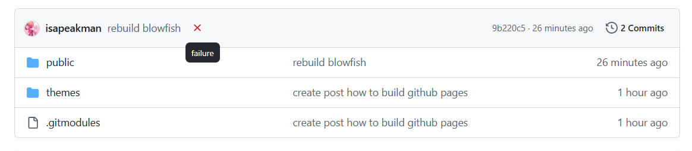

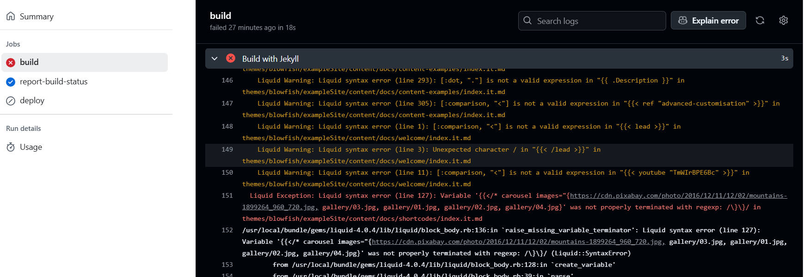

由于 默认使用Jekll进行部署，可尝试在/public下创建.`nojekyll`文件

如果仍然不行，可以使用 

```shell
# Sample workflow for building and deploying a Hugo site to GitHub Pages
name: Deploy Hugo site to Pages

on:
  # Runs on pushes targeting the default branch
  push:
    branches:
      - main

  # Allows you to run this workflow manually from the Actions tab
  workflow_dispatch:

# Sets permissions of the GITHUB_TOKEN to allow deployment to GitHub Pages
permissions:
  contents: read
  pages: write
  id-token: write

# Allow only one concurrent deployment, skipping runs queued between the run in-progress and latest queued.
# However, do NOT cancel in-progress runs as we want to allow these production deployments to complete.
concurrency:
  group: "pages"
  cancel-in-progress: false

# Default to bash
defaults:
  run:
    shell: bash

jobs:
  # Build job
  build:
    runs-on: ubuntu-latest
    env:
      HUGO_VERSION: 0.147.3
      HUGO_ENVIRONMENT: production
      TZ: America/Los_Angeles
    steps:
      - name: Install Hugo CLI
        run: |
          wget -O ${{ runner.temp }}/hugo.deb https://github.com/gohugoio/hugo/releases/download/v${HUGO_VERSION}/hugo_extended_${HUGO_VERSION}_linux-amd64.deb \
          && sudo dpkg -i ${{ runner.temp }}/hugo.deb
      - name: Install Dart Sass
        run: sudo snap install dart-sass
      - name: Checkout
        uses: actions/checkout@v4
        with:
          submodules: recursive
          fetch-depth: 0
      - name: Setup Pages
        id: pages
        uses: actions/configure-pages@v5
      - name: Install Node.js dependencies
        run: "[[ -f package-lock.json || -f npm-shrinkwrap.json ]] && npm ci || true"
      - name: Cache Restore
        id: cache-restore
        uses: actions/cache/restore@v4
        with:
          path: |
            ${{ runner.temp }}/hugo_cache
          key: hugo-${{ github.run_id }}
          restore-keys:
            hugo-
      - name: Configure Git
        run: git config core.quotepath false
      - name: Build with Hugo
        run: |
          hugo \
            --gc \
            --minify \
            --baseURL "${{ steps.pages.outputs.base_url }}/" \
            --cacheDir "${{ runner.temp }}/hugo_cache"
      - name: Cache Save
        id: cache-save
        uses: actions/cache/save@v4
        with:
          path: |
            ${{ runner.temp }}/hugo_cache
          key: ${{ steps.cache-restore.outputs.cache-primary-key }}
      - name: Upload artifact
        uses: actions/upload-pages-artifact@v3
        with:
          path: ./public

  # Deployment job
  deploy:
    environment:
      name: github-pages
      url: ${{ steps.deployment.outputs.page_url }}
    runs-on: ubuntu-latest
    needs: build
    steps:
      - name: Deploy to GitHub Pages
        id: deployment
        uses: actions/deploy-pages@v4
```


后续 更新文章基本步骤   hugo --> 推送代码  -->github自动部署deploy


## 参考文章致谢

[如何使用 Github Page 搭建自己的博客 · 瞳のBlog](https://www.hetong-re4per.com/posts/how-bulid-blog-on-github-page/)

[利用Hugo+Stack主题快速构建个人网站 - 简书](https://www.jianshu.com/p/14d4206f0725)


### 题外话

重新开启Githu Pages website

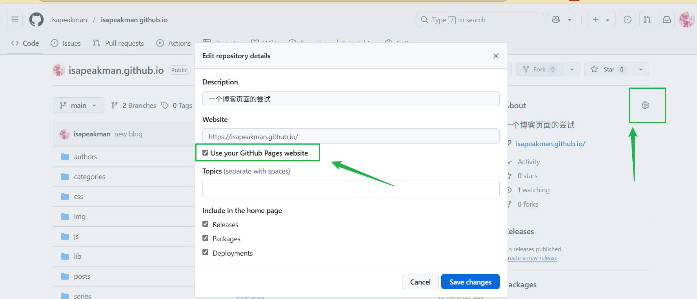

排版问题

尝试使用 0.147.1的版本


